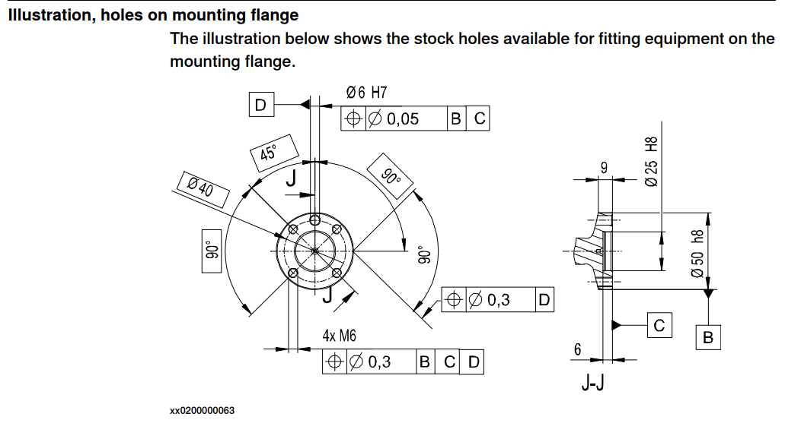
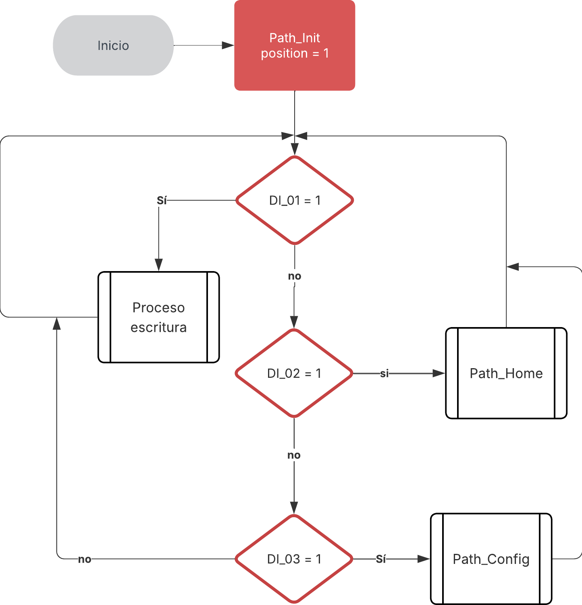
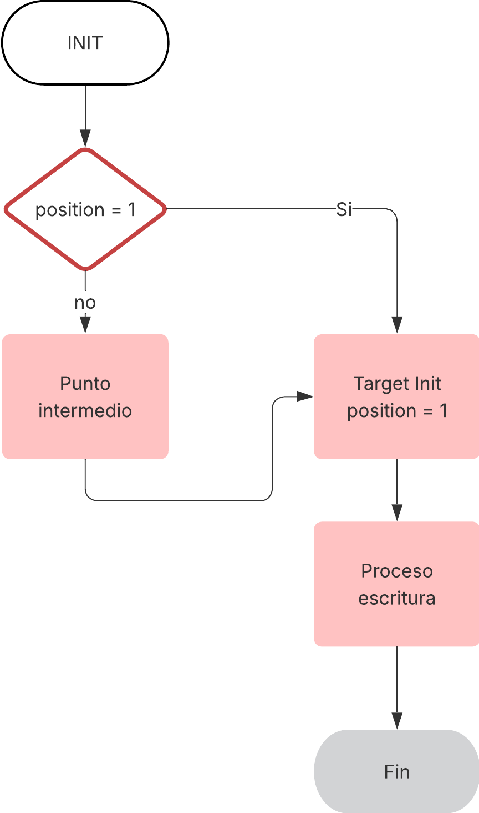

# Laboratorio No. 01 Robótica Industrial - Trayectorias, Entradas y Salidas Digitales.

## Integrantes

**Juan Angel Vargas Rodríguez**
**juvargasro@unal.edu.co**

**Santiago Mariño Cortés**
**smarinoc@unal.edu.co**

**Juan José Delgado Estrada**
**judelgadoe@unal.edu.co**

## Introducción
En la práctica se buscaba manipular un robot industrial IRB 140 con el objetivo de familiarizarse con esta máquina mediante la realización de una rutina de trabajo que consistía en la decoración de una superficie que simulara a una torta de cumpleaños y de esta forma aplicar conceptos vistos en clase de forma práctica. Para ello se tuvieron que identificar las partes IRB 140 y su funcionamiento para poder realizar el proceso de diseño una herramienta que se acoplara al manipulador y desarrollar una rutina de código conociendo las limitaciones y características claves tanto del IRB 140 como del entorno de RobotStudio.

## Planteamiento del problema
En la industria de alimentos, en especial panadería, quieren mejorar su proceso de producción. La decoración de tortas es una actividad que se cree que puede ser ejecutada por robots, es por ello que se propuso realizar dicha actividad sobre una superficie plana, escribiendo los nombres de cada intergrante del grupo y dibujar algún tipo de decoración adicional. El desarrollo de la actividad tenía las siguientes limitaciones:

◦El tamaño de la torta debe ser para 20 personas.

◦Las trayectorias desarrolladas deberán realizarse en un rango de velocidades entre 100 y 1000.

◦La zona tolerable de errores máxima debe ser de z10.

◦El movimiento debe partir de una posición home especificada (puede ser el home del robot) y realizar la
trayectoria de cada palabra y decoración con un trazo continuo. El movimiento debe finalizar en la misma
posición de home en la que se inició.

◦La decoración de la torta debe ser realizada sobre una torta virtual.

◦Los nombres deben estar separados.

## Objetivos
◦Conocer los elementos de un robot industrial.

◦Realizar la calibración de herramientas en el robot real, así como en RobotStudio.

◦Identificar los tipos de movimientos en el espacio de la herramienta útiles para trabajos de manipulación.

◦Ampliar el manejo de funciones proporcionadas por RobotStudio.

◦Utilizar diversas funciones de RAPID.

◦Utilizar el módulo de entradas y salidas digitales dispuesto en el controlador IRC5.

## Desarrollo de la práctica

En la etapa inicial de la práctica se realizó el reconocimiento del entorno de robotstudio así como la familiarización con el IRB 140 haciendo reconocimiento de sus partes y realizando movimientos básicos del manipulador de forma manual. Posteriormente vino la etapa de diseño de la herramienta para fijar el marcador al flanche del robot en el software CAD Inventor.

### Diseño de la herramienta



## Diagrama de flujo de acciones del robot.
### Diagrama de flujo principal:

<p align="center">
  
</p>

### Diagramas de flujo de los paths: 
**Proceso escritura**
<p align="center">
  
</p>

**Path Home**
<p align="center">
  
</p>

**Path Config**
<p align="center">
  
</p>

### Funciones Utilizadas

### Código en Rapid

```rapid

MODULE Module1

    CONST robtarget Target_10:=[[-694.73,238.6,283.52],[0,1,0,0],[0,0,0,0],[9E+09,9E+09,9E+09,9E+09,9E+09,9E+09]];
    CONST robtarget Target_20:=[[-654.02,238.6,283.52],[0,1,0,0],[0,0,0,0],[9E+09,9E+09,9E+09,9E+09,9E+09,9E+09]];
    CONST robtarget Target_30:=[[-643.85,227.85,283.52],[0,1,0,0],[0,0,0,0],[9E+09,9E+09,9E+09,9E+09,9E+09,9E+09]];
    CONST robtarget Target_40:=[[-654.02,217.2,283.52],[0,1,0,0],[0,0,0,0],[9E+09,9E+09,9E+09,9E+09,9E+09,9E+09]];
    CONST robtarget Target_50:=[[-544.31790343,172.259854367,496.430235891],[0.016376198,-0.982576919,0.151768324,0.106022613],[1,0,-1,0],[9E+09,9E+09,9E+09,9E+09,9E+09,9E+09]];
    CONST robtarget Target_60_3:=[[-694.73,251.5,293.52],[0,1,0,0],[0,0,0,0],[9E+09,9E+09,9E+09,9E+09,9E+09,9E+09]];
    CONST robtarget Target_60:=[[-694.73,251.5,283.52],[0,1,0,0],[0,0,0,0],[9E+09,9E+09,9E+09,9E+09,9E+09,9E+09]];
    CONST robtarget Target_70:=[[-659.11,251.5,283.52],[0,1,0,0],[0,0,0,0],[9E+09,9E+09,9E+09,9E+09,9E+09,9E+09]];
    CONST robtarget Target_80:=[[-643.85,262.25,283.52],[0,1,0,0],[0,0,0,0],[9E+09,9E+09,9E+09,9E+09,9E+09,9E+09]];
    CONST robtarget Target_90:=[[-659.11,278,283.52],[0,1,0,0],[0,0,0,0],[9E+09,9E+09,9E+09,9E+09,9E+09,9E+09]];
    CONST robtarget Target_100:=[[-694.73,278,283.52],[0,1,0,0],[0,0,0,0],[9E+09,9E+09,9E+09,9E+09,9E+09,9E+09]];
    CONST robtarget Target_100_2:=[[-694.73,278,293.52],[0,1,0,0],[0,0,0,0],[9E+09,9E+09,9E+09,9E+09,9E+09,9E+09]];
    CONST robtarget Target_10_2:=[[-694.73,238.6,293.52],[0,1,0,0],[0,0,0,0],[9E+09,9E+09,9E+09,9E+09,9E+09,9E+09]];
    CONST robtarget Target_40_4:=[[-654.02,217.2,293.52],[0,1,0,0],[0,0,0,0],[9E+09,9E+09,9E+09,9E+09,9E+09,9E+09]];
    CONST robtarget Target_110_2:=[[-643.85,285.8,293.52],[0,1,0,0],[0,0,0,0],[9E+09,9E+09,9E+09,9E+09,9E+09,9E+09]];
    CONST robtarget Target_110:=[[-643.85,285.8,283.52],[0,1,0,0],[0,0,0,0],[9E+09,9E+09,9E+09,9E+09,9E+09,9E+09]];
    CONST robtarget Target_120:=[[-694.73,300.85,283.52],[0,1,0,0],[0,0,0,0],[9E+09,9E+09,9E+09,9E+09,9E+09,9E+09]];
    CONST robtarget Target_130:=[[-643.85,315.9,283.52],[0,1,0,0],[0,0,0,0],[9E+09,9E+09,9E+09,9E+09,9E+09,9E+09]];
    CONST robtarget Target_130_2:=[[-643.85,315.9,293.52],[0,1,0,0],[0,0,0,0],[9E+09,9E+09,9E+09,9E+09,9E+09,9E+09]];
    CONST robtarget Target_140_2:=[[-669.29,290.1,293.52],[0,1,0,0],[0,0,0,0],[9E+09,9E+09,9E+09,9E+09,9E+09,9E+09]];
    CONST robtarget Target_140:=[[-669.29,290.1,283.52],[0,1,0,0],[0,0,0,0],[9E+09,9E+09,9E+09,9E+09,9E+09,9E+09]];
    CONST robtarget Target_150:=[[-669.29,311.6,283.52],[0,1,0,0],[0,0,0,0],[9E+09,9E+09,9E+09,9E+09,9E+09,9E+09]];
    CONST robtarget Target_150_2:=[[-669.29,311.6,293.52],[0,1,0,0],[0,0,0,0],[9E+09,9E+09,9E+09,9E+09,9E+09,9E+09]];
    CONST robtarget Target_160_2:=[[-643.85,324.4,293.52],[0,1,0,0],[0,0,0,0],[9E+09,9E+09,9E+09,9E+09,9E+09,9E+09]];
    CONST robtarget Target_160:=[[-643.85,324.4,283.52],[0,1,0,0],[0,0,0,0],[9E+09,9E+09,9E+09,9E+09,9E+09,9E+09]];
    CONST robtarget Target_170:=[[-694.73,324.4,283.52],[0,1,0,0],[0,0,0,0],[9E+09,9E+09,9E+09,9E+09,9E+09,9E+09]];
    CONST robtarget Target_180:=[[-643.85,354.5,283.52],[0,1,0,0],[0,0,0,0],[9E+09,9E+09,9E+09,9E+09,9E+09,9E+09]];
    CONST robtarget Target_190:=[[-694.73,354.5,283.52],[0,1,0,0],[0,0,0,0],[9E+09,9E+09,9E+09,9E+09,9E+09,9E+09]];
    CONST robtarget Target_190_2:=[[-694.73,354.5,293.52],[0,1,0,0],[0,0,0,0],[9E+09,9E+09,9E+09,9E+09,9E+09,9E+09]];
    PERS tooldata Portamarcador:=[TRUE,[[109.712,0,129.534],[0.923879533,0,0.382683432,0]],[0.1,[0,0,1],[1,0,0,0],0,0,0]];
    TASK PERS wobjdata Workobject_1:=[FALSE,TRUE,"",[[50,0,35],[1,0,0,0]],[[0,0,0],[1,0,0,0]]];
    CONST robtarget Target_200:=[[-626,260,283.52],[0,1,0,0],[0,0,0,0],[9E+09,9E+09,9E+09,9E+09,9E+09,9E+09]];
    CONST robtarget Target_210:=[[-600,280,283.52],[0,1,0,0],[0,0,0,0],[9E+09,9E+09,9E+09,9E+09,9E+09,9E+09]];
    CONST robtarget Target_200_2:=[[-626,260,303.52],[0,1,0,0],[1,0,-1,0],[9E+09,9E+09,9E+09,9E+09,9E+09,9E+09]];
    CONST robtarget Target_210_2:=[[-600,280,303.52],[0,1,0,0],[0,0,0,0],[9E+09,9E+09,9E+09,9E+09,9E+09,9E+09]];
    CONST robtarget Target_220:=[[-626,280,283.52],[0,1,0,0],[1,0,-1,0],[9E+09,9E+09,9E+09,9E+09,9E+09,9E+09]];
    CONST robtarget Target_230:=[[-600,260,283.52],[0,1,0,0],[1,0,-1,0],[9E+09,9E+09,9E+09,9E+09,9E+09,9E+09]];
    CONST robtarget Target_230_2:=[[-600,260,303.52],[0,1,0,0],[1,0,-1,0],[9E+09,9E+09,9E+09,9E+09,9E+09,9E+09]];
    CONST robtarget Target_240_2:=[[-626,295,303.52],[0,1,0,0],[0,0,0,0],[9E+09,9E+09,9E+09,9E+09,9E+09,9E+09]];
    CONST robtarget Target_240:=[[-626,286,283.52],[0,1,0,0],[0,0,0,0],[9E+09,9E+09,9E+09,9E+09,9E+09,9E+09]];
    CONST robtarget Target_250:=[[-629,301,283.52],[0,1,0,0],[0,0,0,0],[9E+09,9E+09,9E+09,9E+09,9E+09,9E+09]];
    CONST robtarget Target_260:=[[-600,290,283.52],[0,1,0,0],[0,0,0,0],[9E+09,9E+09,9E+09,9E+09,9E+09,9E+09]];
    CONST robtarget Target_270:=[[-600,303,283.52],[0,1,0,0],[1,0,-1,0],[9E+09,9E+09,9E+09,9E+09,9E+09,9E+09]];
    CONST robtarget Target_270_2:=[[-600,303,303.52],[0,1,0,0],[1,0,-1,0],[9E+09,9E+09,9E+09,9E+09,9E+09,9E+09]];
    CONST robtarget Target_280_2:=[[-590,240,301.02],[0,1,0,0],[1,0,-1,0],[9E+09,9E+09,9E+09,9E+09,9E+09,9E+09]];
    CONST robtarget Target_280:=[[-590,240,281.02],[0,1,0,0],[1,0,-1,0],[9E+09,9E+09,9E+09,9E+09,9E+09,9E+09]];
    CONST robtarget Target_290:=[[-590,220,281.02],[0,1,0,0],[1,0,-1,0],[9E+09,9E+09,9E+09,9E+09,9E+09,9E+09]];
    CONST robtarget Target_300:=[[-585,215,281.214051369],[0,1,0,0],[1,0,-1,0],[9E+09,9E+09,9E+09,9E+09,9E+09,9E+09]];
    CONST robtarget Target_310:=[[-580,220,281.02],[0,1,0,0],[1,0,-1,0],[9E+09,9E+09,9E+09,9E+09,9E+09,9E+09]];
    CONST robtarget Target_320:=[[-580,240,281.02],[0,1,0,0],[1,0,-1,0],[9E+09,9E+09,9E+09,9E+09,9E+09,9E+09]];
    CONST robtarget Target_330:=[[-572.5,245,281.02],[0,1,0,0],[1,0,-1,0],[9E+09,9E+09,9E+09,9E+09,9E+09,9E+09]];
    CONST robtarget Target_340:=[[-565,240,281.02],[0,1,0,0],[1,0,-1,0],[9E+09,9E+09,9E+09,9E+09,9E+09,9E+09]];
    CONST robtarget Target_350:=[[-565,220,281.02],[0,1,0,0],[1,0,-1,0],[9E+09,9E+09,9E+09,9E+09,9E+09,9E+09]];
    CONST robtarget Target_350_2:=[[-565,220,301.02],[0,1,0,0],[1,0,-1,0],[9E+09,9E+09,9E+09,9E+09,9E+09,9E+09]];
    CONST robtarget Target_360:=[[-565,250,281.02],[0,1,0,0],[1,0,-1,0],[9E+09,9E+09,9E+09,9E+09,9E+09,9E+09]];
    CONST robtarget Target_370:=[[-590,260,281.02],[0,1,0,0],[1,0,-1,0],[9E+09,9E+09,9E+09,9E+09,9E+09,9E+09]];
    CONST robtarget Target_380:=[[-565,270,281.02],[0,1,0,0],[1,0,-1,0],[9E+09,9E+09,9E+09,9E+09,9E+09,9E+09]];
    CONST robtarget Target_380_2:=[[-565,270,301.02],[0,1,0,0],[1,0,-1,0],[9E+09,9E+09,9E+09,9E+09,9E+09,9E+09]];
    CONST robtarget Target_390:=[[-578,255,281.02],[0,1,0,0],[1,0,-1,0],[9E+09,9E+09,9E+09,9E+09,9E+09,9E+09]];
    CONST robtarget Target_400:=[[-578,265,281.02],[0,1,0,0],[1,0,-1,0],[9E+09,9E+09,9E+09,9E+09,9E+09,9E+09]];
    CONST robtarget Target_400_2:=[[-578,265,301.02],[0,1,0,0],[1,0,-1,0],[9E+09,9E+09,9E+09,9E+09,9E+09,9E+09]];
    CONST robtarget Target_410:=[[-565,275,281.02],[0,1,0,0],[1,0,-1,0],[9E+09,9E+09,9E+09,9E+09,9E+09,9E+09]];
    CONST robtarget Target_420:=[[-590,275,281.02],[0,1,0,0],[1,0,-1,0],[9E+09,9E+09,9E+09,9E+09,9E+09,9E+09]];
    CONST robtarget Target_430:=[[-565,295,281.02],[0,1,0,0],[1,0,-1,0],[9E+09,9E+09,9E+09,9E+09,9E+09,9E+09]];
    CONST robtarget Target_440:=[[-590,295,281.02],[0,1,0,0],[1,0,-1,0],[9E+09,9E+09,9E+09,9E+09,9E+09,9E+09]];
    CONST robtarget Target_440_2:=[[-590,295,301.02],[0,1,0,0],[1,0,-1,0],[9E+09,9E+09,9E+09,9E+09,9E+09,9E+09]];
    CONST robtarget Target_450:=[[-590,300,281.02],[0,1,0,0],[1,0,-1,0],[9E+09,9E+09,9E+09,9E+09,9E+09,9E+09]];
    CONST robtarget Target_460:=[[-590,320,281.02],[0,1,0,0],[1,0,-1,0],[9E+09,9E+09,9E+09,9E+09,9E+09,9E+09]];
    CONST robtarget Target_460_2:=[[-590,320,301.02],[0,1,0,0],[1,0,-1,0],[9E+09,9E+09,9E+09,9E+09,9E+09,9E+09]];
    CONST robtarget Target_470:=[[-590,310,281.02],[0,1,0,0],[1,0,-1,0],[9E+09,9E+09,9E+09,9E+09,9E+09,9E+09]];
    CONST robtarget Target_480:=[[-565,310,281.02],[0,1,0,0],[1,0,-1,0],[9E+09,9E+09,9E+09,9E+09,9E+09,9E+09]];
    CONST robtarget Target_480_2:=[[-565,310,301.02],[0,1,0,0],[1,0,-1,0],[9E+09,9E+09,9E+09,9E+09,9E+09,9E+09]];
    CONST robtarget Target_490:=[[-590,325,281.02],[0,1,0,0],[1,0,-1,0],[9E+09,9E+09,9E+09,9E+09,9E+09,9E+09]];
    CONST robtarget Target_500:=[[-590,345,281.02],[0,1,0,0],[1,0,-1,0],[9E+09,9E+09,9E+09,9E+09,9E+09,9E+09]];
    CONST robtarget Target_500_2:=[[-590,345,301.02],[0,1,0,0],[1,0,-1,0],[9E+09,9E+09,9E+09,9E+09,9E+09,9E+09]];
    CONST robtarget Target_510:=[[-590,335,281.02],[0,1,0,0],[1,0,-1,0],[9E+09,9E+09,9E+09,9E+09,9E+09,9E+09]];
    CONST robtarget Target_520:=[[-565,335,281.02],[0,1,0,0],[1,0,-1,0],[9E+09,9E+09,9E+09,9E+09,9E+09,9E+09]];
    CONST robtarget Target_520_2:=[[-565,335,301.02],[0,1,0,0],[1,0,-1,0],[9E+09,9E+09,9E+09,9E+09,9E+09,9E+09]];
    CONST robtarget Target_530:=[[-565,325,281.02],[0,1,0,0],[1,0,-1,0],[9E+09,9E+09,9E+09,9E+09,9E+09,9E+09]];
    CONST robtarget Target_540:=[[-565,345,281.02],[0,1,0,0],[1,0,-1,0],[9E+09,9E+09,9E+09,9E+09,9E+09,9E+09]];
    CONST jointtarget JointTarget_1:=[[0,0,0,0,0,0],[9E+09,9E+09,9E+09,9E+09,9E+09,9E+09]];
    CONST robtarget Target_550:=[[-40.44,-662.16369974,682.71],[0.298807166,0.664472091,0.640860248,-0.241845531],[0,0,0,0],[9E+09,9E+09,9E+09,9E+09,9E+09,9E+09]];
    CONST robtarget Target_560:=[[-259.298529285,387.166901486,828.503632543],[0.167094317,0.622780608,-0.496472066,-0.581153415],[1,0,0,0],[9E+09,9E+09,9E+09,9E+09,9E+09,9E+09]];
    VAR num position := 0; 
    CONST robtarget Target_570:=[[-630,341.65,283.52],[0,1,0,0],[0,0,0,0],[9E+09,9E+09,9E+09,9E+09,9E+09,9E+09]];
    CONST robtarget Target_590:=[[-615,326.65,283.52],[0,1,0,0],[0,0,0,0],[9E+09,9E+09,9E+09,9E+09,9E+09,9E+09]];
    CONST robtarget Target_580:=[[-600,341.65,283.52],[0,1,0,0],[0,0,0,0],[9E+09,9E+09,9E+09,9E+09,9E+09,9E+09]];
    CONST robtarget Target_600:=[[-615,356.65,283.52],[0,1,0,0],[0,0,0,0],[9E+09,9E+09,9E+09,9E+09,9E+09,9E+09]];
    CONST robtarget Target_570_2:=[[-630,341.65,293.52],[0,1,0,0],[0,0,0,0],[9E+09,9E+09,9E+09,9E+09,9E+09,9E+09]];
    CONST robtarget Target_610:=[[-622.5,349.15,283.52],[0,1,0,0],[0,0,0,0],[9E+09,9E+09,9E+09,9E+09,9E+09,9E+09]];
    CONST robtarget Target_620:=[[-615,341.65,283.52],[0,1,0,0],[0,0,0,0],[9E+09,9E+09,9E+09,9E+09,9E+09,9E+09]];
    CONST robtarget Target_630:=[[-607.5,334.15,283.52],[0,1,0,0],[0,0,0,0],[9E+09,9E+09,9E+09,9E+09,9E+09,9E+09]];
    CONST robtarget Target_580_2:=[[-600,341.65,293.52],[0,1,0,0],[0,0,0,0],[9E+09,9E+09,9E+09,9E+09,9E+09,9E+09]];
    CONST robtarget Target_640_2:=[[-607.5,341.65,293.52],[0,1,0,0],[0,0,0,0],[9E+09,9E+09,9E+09,9E+09,9E+09,9E+09]];
    CONST robtarget Target_640:=[[-607.5,341.65,283.52],[0,1,0,0],[0,0,0,0],[9E+09,9E+09,9E+09,9E+09,9E+09,9E+09]];
    CONST robtarget Target_650_2:=[[-622.5,341.65,293.52],[0,1,0,0],[0,0,0,0],[9E+09,9E+09,9E+09,9E+09,9E+09,9E+09]];
    CONST robtarget Target_650:=[[-622.5,341.65,283.52],[0,1,0,0],[0,0,0,0],[9E+09,9E+09,9E+09,9E+09,9E+09,9E+09]];
    
    PROC main()
        Reset Conveyor_INV;
        Reset Conveyor_FWD;
        Path_Init;
        WHILE TRUE DO
            IF DI_01 = 1 THEN
                Set DO_01;
                Path_Init;
                
                Set Conveyor_INV;
                Set Conveyor_FWD;
                WaitTime 1;
                Reset Conveyor_FWD;
                
                Path_Init;
                Path_30;
                Path_20;
                Path_40;
                path_50;
                Path_70;
                Path_80;
                Path_270;
                Path_90;
                Path_100;
                Path_110;
                Path_120;
                Path_130;
                Path_140;
                Path_150;
                Path_160;
                Path_170;
                Path_180;
                Path_190;
                Path_200;
                Path_210;
                Path_220;
                Path_230;
                Path_240;
                
                Path_Init;
                
                WaitTime 2;
                Set Conveyor_FWD;
                WaitTime 2.75;
                Reset Conveyor_FWD;
                Reset Conveyor_INV;
                Reset DO_01;
                
            ELSEIF DI_02 = 1 THEN 
                Path_Home;
            ELSEIF DI_03 = 1 THEN
                Path_Config;
            ENDIF
        ENDWHILE
        
    ENDPROC
    
    PROC Path_Init()
        IF position = 1 THEN
            MoveJ Target_50,v200,z1,Portamarcador\WObj:=Workobject_1;
        ELSEIF position = 2 THEN
            MoveJ Target_560,v200,z1,Portamarcador\WObj:=Workobject_1;
            MoveJ Target_50,v200,z1,Portamarcador\WObj:=Workobject_1;
        ELSEIF position = 3 THEN
            MoveJ Target_560,v200,z1,Portamarcador\WObj:=Workobject_1;
            MoveJ Target_50,v200,z1,Portamarcador\WObj:=Workobject_1;
        ELSEIF position = 0 THEN
            MoveJ Target_560,v200,z1,Portamarcador\WObj:=Workobject_1;
            MoveJ Target_50,v200,z1,Portamarcador\WObj:=Workobject_1;
        ENDIF
        position := 1;
    ENDPROC
    PROC Path_20()
        MoveJ Target_60_3,v200,z1,Portamarcador\WObj:=Workobject_1;
        MoveL Target_60,v200,z1,Portamarcador\WObj:=Workobject_1;
        MoveL Target_70,v200,z1,Portamarcador\WObj:=Workobject_1;
        MoveC Target_80,Target_90,v200,z1,Portamarcador\WObj:=Workobject_1;
        MoveL Target_100,v200,z1,Portamarcador\WObj:=Workobject_1;
        MoveL Target_100_2,v200,z1,Portamarcador\WObj:=Workobject_1;
    ENDPROC
    PROC Path_30()
        MoveJ Target_10_2,v200,z1,Portamarcador\WObj:=Workobject_1;
        MoveL Target_10,v200,z1,Portamarcador\WObj:=Workobject_1;
        MoveL Target_20,v200,z1,Portamarcador\WObj:=Workobject_1;
        MoveC Target_30,Target_40,v200,z1,Portamarcador\WObj:=Workobject_1;
        MoveL Target_40_4,v200,z1,Portamarcador\WObj:=Workobject_1;
    ENDPROC
    PROC Path_40()
        MoveJ Target_110_2,v200,z1,Portamarcador\WObj:=Workobject_1;
        MoveL Target_110,v200,z1,Portamarcador\WObj:=Workobject_1;
        MoveL Target_120,v200,z1,Portamarcador\WObj:=Workobject_1;
        MoveL Target_130,v200,z1,Portamarcador\WObj:=Workobject_1;
        MoveL Target_130_2,v200,z1,Portamarcador\WObj:=Workobject_1;
        MoveJ Target_140_2,v200,z1,Portamarcador\WObj:=Workobject_1;
        MoveL Target_140,v200,z1,Portamarcador\WObj:=Workobject_1;
        MoveL Target_150,v200,z1,Portamarcador\WObj:=Workobject_1;
        MoveL Target_150_2,v200,z1,Portamarcador\WObj:=Workobject_1;
    ENDPROC
    PROC Path_50()
        MoveJ Target_160_2,v200,z1,Portamarcador\WObj:=Workobject_1;
        MoveL Target_160,v200,z1,Portamarcador\WObj:=Workobject_1;
        MoveL Target_170,v200,z1,Portamarcador\WObj:=Workobject_1;
        MoveL Target_180,v200,z1,Portamarcador\WObj:=Workobject_1;
        MoveL Target_190,v200,z1,Portamarcador\WObj:=Workobject_1;
        MoveL Target_190_2,v200,z1,Portamarcador\WObj:=Workobject_1;
    ENDPROC
    PROC Path_60()

    ENDPROC
    PROC Path_70()
        MoveJ Target_200_2,v200,z1,Portamarcador\WObj:=Workobject_1;
        MoveL Target_200,v200,z1,Portamarcador\WObj:=Workobject_1;
        MoveL Target_210,v200,z1,Portamarcador\WObj:=Workobject_1;
        MoveL Target_210_2,v200,z1,Portamarcador\WObj:=Workobject_1;
        MoveL Target_220,v200,z1,Portamarcador\WObj:=Workobject_1;
        MoveL Target_230,v200,z1,Portamarcador\WObj:=Workobject_1;
        MoveL Target_230_2,v200,z1,Portamarcador\WObj:=Workobject_1;
    ENDPROC
    PROC Path_80()
        MoveL Target_240_2,v200,z1,Portamarcador\WObj:=Workobject_1;
        MoveL Target_240,v200,z1,Portamarcador\WObj:=Workobject_1;
        MoveL Target_250,v200,z1,Portamarcador\WObj:=Workobject_1;
        MoveL Target_260,v200,z1,Portamarcador\WObj:=Workobject_1;
        MoveL Target_270,v200,z1,Portamarcador\WObj:=Workobject_1;
        MoveL Target_270_2,v200,z1,Portamarcador\WObj:=Workobject_1;
    ENDPROC
    PROC Path_90()
        MoveL Target_280_2,v200,z100,Portamarcador\WObj:=Workobject_1;
        MoveL Target_280,v200,z100,Portamarcador\WObj:=Workobject_1;
        MoveL Target_290,v200,z100,Portamarcador\WObj:=Workobject_1;
    ENDPROC
    PROC Path_100()
        MoveL Target_290,v200,z1,Portamarcador\WObj:=Workobject_1;
        MoveL Target_300,v200,z1,Portamarcador\WObj:=Workobject_1;
        MoveL Target_310,v200,z1,Portamarcador\WObj:=Workobject_1;
    ENDPROC
    PROC Path_110()
        MoveL Target_310,v200,z1,Portamarcador\WObj:=Workobject_1;
        MoveL Target_320,v200,z1,Portamarcador\WObj:=Workobject_1;
    ENDPROC
    PROC Path_120()
        MoveL Target_320,v200,z1,Portamarcador\WObj:=Workobject_1;
        MoveL Target_330,v200,z1,Portamarcador\WObj:=Workobject_1;
        MoveL Target_340,v200,z1,Portamarcador\WObj:=Workobject_1;
    ENDPROC
    PROC Path_130()
        MoveL Target_340,v200,z1,Portamarcador\WObj:=Workobject_1;
        MoveL Target_350,v200,z1,Portamarcador\WObj:=Workobject_1;
        MoveL Target_350_2,v200,z1,Portamarcador\WObj:=Workobject_1;
    ENDPROC
    PROC Path_140()
        MoveL Target_360,v200,z1,Portamarcador\WObj:=Workobject_1;
        MoveL Target_370,v200,z1,Portamarcador\WObj:=Workobject_1;
    ENDPROC
    PROC Path_150()
        MoveL Target_370,v200,z1,Portamarcador\WObj:=Workobject_1;
        MoveL Target_380,v200,z1,Portamarcador\WObj:=Workobject_1;
        MoveL Target_380_2,v200,z1,Portamarcador\WObj:=Workobject_1;
    ENDPROC
    PROC Path_160()
        MoveL Target_390,v200,z1,Portamarcador\WObj:=Workobject_1;
        MoveL Target_400,v200,z1,Portamarcador\WObj:=Workobject_1;
        MoveL Target_400_2,v200,z1,Portamarcador\WObj:=Workobject_1;
    ENDPROC
    PROC Path_170()
        MoveL Target_410,v200,z1,Portamarcador\WObj:=Workobject_1;
        MoveL Target_420,v200,z1,Portamarcador\WObj:=Workobject_1;
    ENDPROC
    PROC Path_180()
        MoveL Target_420,v200,z1,Portamarcador\WObj:=Workobject_1;
        MoveL Target_430,v200,z1,Portamarcador\WObj:=Workobject_1;
    ENDPROC
    PROC Path_190()
        MoveL Target_430,v200,z1,Portamarcador\WObj:=Workobject_1;
        MoveL Target_440,v200,z1,Portamarcador\WObj:=Workobject_1;
        MoveL Target_440_2,v200,z1,Portamarcador\WObj:=Workobject_1;
    ENDPROC
    PROC Path_200()
        MoveL Target_450,v200,z1,Portamarcador\WObj:=Workobject_1;
        MoveL Target_460,v200,z1,Portamarcador\WObj:=Workobject_1;
        MoveL Target_460_2,v200,z1,Portamarcador\WObj:=Workobject_1;
    ENDPROC
    PROC Path_210()
        MoveL Target_470,v200,z1,Portamarcador\WObj:=Workobject_1;
        MoveL Target_480,v200,z1,Portamarcador\WObj:=Workobject_1;
        MoveL Target_480_2,v200,z1,Portamarcador\WObj:=Workobject_1;
    ENDPROC
    PROC Path_220()
        MoveL Target_490,v200,z1,Portamarcador\WObj:=Workobject_1;
        MoveL Target_500,v200,z1,Portamarcador\WObj:=Workobject_1;
        MoveL Target_500_2,v200,z1,Portamarcador\WObj:=Workobject_1;
    ENDPROC
    PROC Path_230()
        MoveL Target_510,v200,z1,Portamarcador\WObj:=Workobject_1;
        MoveL Target_520,v200,z1,Portamarcador\WObj:=Workobject_1;
        MoveL Target_520_2,v200,z1,Portamarcador\WObj:=Workobject_1;
    ENDPROC
    PROC Path_240()
        MoveL Target_530,v200,z1,Portamarcador\WObj:=Workobject_1;
        MoveL Target_540,v200,z1,Portamarcador\WObj:=Workobject_1;
    ENDPROC
    PROC Path_Home()
        IF position = 1 THEN
            MoveJ Target_560,v200,z1,Portamarcador\WObj:=Workobject_1;
            MoveAbsJ JointTarget_1,v200,z1,Portamarcador\WObj:=Workobject_1;
        ELSEIF position = 2 THEN
            MoveAbsJ JointTarget_1,v200,z1,Portamarcador\WObj:=Workobject_1;
        ELSEIF position = 3 THEN
            MoveAbsJ JointTarget_1,v200,z1,Portamarcador\WObj:=Workobject_1;
        ENDIF
        position := 2;
    ENDPROC
    PROC Path_Config()
        IF position = 1 THEN
            MoveJ Target_560,v200,z1,Portamarcador\WObj:=Workobject_1;  
            MoveJ Target_550,v200,z1,Portamarcador\WObj:=Workobject_1;
        ELSEIF position = 2 THEN
            MoveJ Target_550,v200,z1,Portamarcador\WObj:=Workobject_1;
        ELSEIF position = 3 THEN
            MoveJ Target_550,v200,z1,Portamarcador\WObj:=Workobject_1;
        ENDIF
        position := 3;
    ENDPROC
    PROC Path_270()
        MoveJ Target_570_2,v200,z1,Portamarcador\WObj:=Workobject_1;
        MoveL Target_570,v200,z1,Portamarcador\WObj:=Workobject_1;
        MoveC Target_590,Target_580,v200,z1,Portamarcador\WObj:=Workobject_1;
        MoveC Target_600,Target_570,v200,z1,Portamarcador\WObj:=Workobject_1;
        MoveC Target_610,Target_620,v200,z1,Portamarcador\WObj:=Workobject_1;
        MoveC Target_630,Target_580,v200,z1,Portamarcador\WObj:=Workobject_1;
        MoveJ Target_580_2,v200,z1,Portamarcador\WObj:=Workobject_1;
        MoveJ Target_640_2,v200,z1,Portamarcador\WObj:=Workobject_1;
        MoveJ Target_640,v200,z1,Portamarcador\WObj:=Workobject_1;
        MoveJ Target_640_2,v200,z1,Portamarcador\WObj:=Workobject_1;
        MoveJ Target_650_2,v200,z1,Portamarcador\WObj:=Workobject_1;
        MoveJ Target_650,v200,z1,Portamarcador\WObj:=Workobject_1;
        MoveJ Target_650_2,v200,z1,Portamarcador\WObj:=Workobject_1;
    ENDPROC
    
ENDMODULE

```

## Video de la simulación

## Video de la implementación física

## Conclusiones
