# Laboratorio No. 01 Robótica Industrial - Trayectorias, Entradas y Salidas Digitales.

## Integrantes

**Juan Ángel Vargas Rodríguez**
juvargasro@unal.edu.co

**Santiago Mariño Cortés**
smarinoc@unal.edu.co

**Juan José Delgado Estrada**
judelgadoe@unal.edu.co

## Introducción
En la práctica se buscaba manipular un robot industrial IRB 140 con el objetivo de familiarizarse con esta máquina mediante la realización de una rutina de trabajo que consistía en la decoración de una superficie que simulara a una torta de cumpleaños y de esta forma aplicar conceptos vistos en clase de forma práctica. Para ello se tuvieron que identificar las partes IRB 140 y su funcionamiento para poder realizar el proceso de diseño una herramienta que se acoplara al manipulador y desarrollar una rutina de código conociendo las limitaciones y características claves tanto del IRB 140 como del entorno de RobotStudio.

## Planteamiento del problema
En la industria de alimentos, en especial panadería, quieren mejorar su proceso de producción. La decoración de tortas es una actividad que se cree que puede ser ejecutada por robots, es por ello que se propuso realizar dicha actividad sobre una superficie plana, escribiendo los nombres de cada integrante del grupo y dibujar algún tipo de decoración adicional. El desarrollo de la actividad tenía las siguientes limitaciones:

- El tamaño de la torta debe ser para 20 personas.
- Las trayectorias desarrolladas deberán realizarse en un rango de velocidades entre 100 y 1000.
- La zona tolerable de errores máxima debe ser de z10.
- El movimiento debe partir de una posición home especificada (puede ser el home del robot) y realizar la trayectoria de cada palabra y decoración con un trazo continuo. El movimiento debe finalizar en la misma posición de home en la que se inició.
- La decoración de la torta debe ser realizada sobre una torta virtual.
- Los nombres deben estar separados.

## Objetivos
- Conocer los elementos de un robot industrial.
- Realizar la calibración de herramientas en el robot real, así como en RobotStudio.
- Identificar los tipos de movimientos en el espacio de la herramienta útiles para trabajos de manipulación.
- Ampliar el manejo de funciones proporcionadas por RobotStudio.
- Utilizar diversas funciones de RAPID.
- Utilizar el módulo de entradas y salidas digitales dispuesto en el controlador IRC5.

## Desarrollo de la práctica

En la etapa inicial de la práctica se realizó el reconocimiento del entorno de robotstudio así como la familiarización con el IRB 140 haciendo reconocimiento de sus partes y realizando movimientos básicos del manipulador de forma manual. Posteriormente vino la etapa de diseño de la herramienta para fijar el marcador al flanche del robot en el software CAD Inventor.

### Diseño de la herramienta

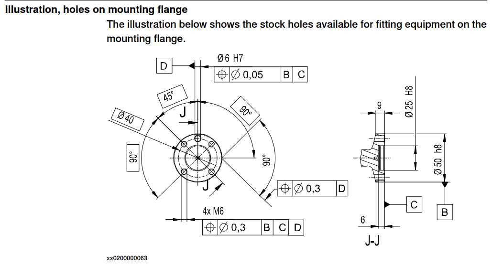

El diseño de la herramienta se realizó con base en las especificaciones del flanche encontradas en el manual de producto del robot IRB 140 y teniendo en cuenta la posición del marcador debería tener cierta inclinación para evitar que se presentaran singularidades en las articulaciones del manipulador y se debía colocar cierta tolerancia mediante un resorte que se contraía de acuerdo a la presión con la que el marcador hiciera contacto con la superficie de trabajo. De acuerdo a esto se realizó el siguiente diseño:

  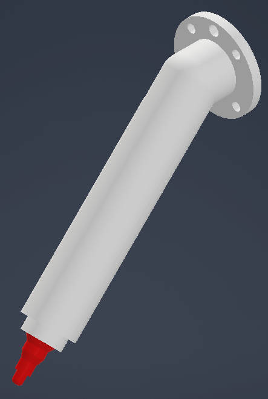

La inclinación seleccionada fue de 45°, 2cm de espacio para un resorte de este largo; la unión de la herramienta al flanche se hace mediante tornillos M6.

Debido a que el marcador se debía poder colocar y retirar de la herramienta que lo acopla al flanche se optó por un diseño en dos partes, la parte inferior actúa como el soporte del marcador y como la base que se une al flanche, mientras que la parte superior sella el marcador con la herramienta y aporta seguridad para evitar movimientos no deseados respecto a la parte inferior. 

  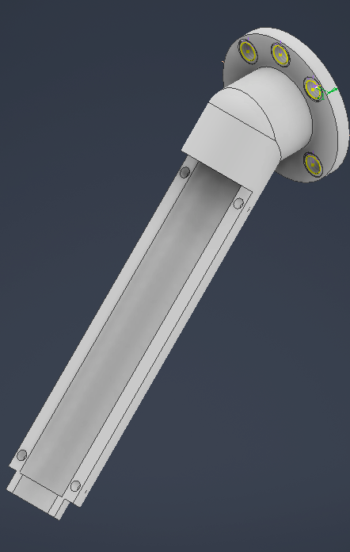

  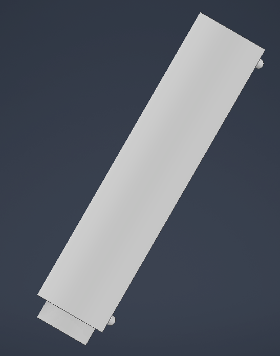

Otra consideración de la herramienta de acople del marcador son las dimensiones del marcador que se iba a utilizar, para ello se realizó el diseño 3D también del marcador mediante las medidas del objeto físico por medio de un calibrador pie de rey, para así con base a las dimensiones poder acoplarlo en la herramienta de soporte de forma óptima.

  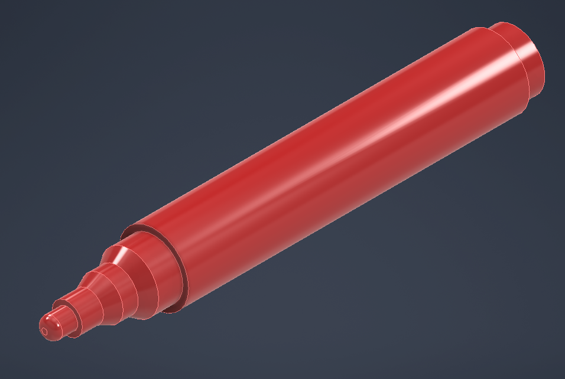

Con base al diseño CAD se realizó la manufactura de la herramienta mediante impresión 3D y el resultado fue el siguiente:

  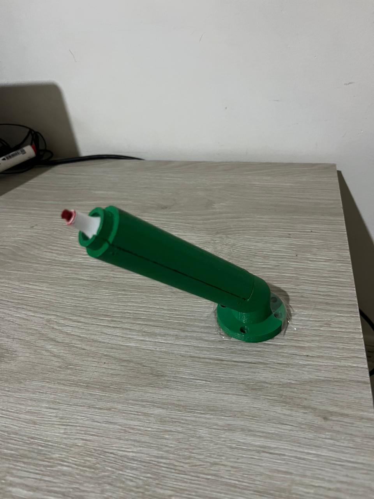

Después de tener la herramienta ya fabricada se procedió con el montaje en el robot y la calibración del TCP que correspondía al punto final de la herramienta y será el contacto con la superficie. Para esto se calibró con una referencia (como se muestra en la siguiente imagen) la cuál debía ser alcanzada desde 4 posiciones diferentes del robot, logrando el menor error posible, después de varios intentos se logró un error de 4mm.

  

Cómo siguiente paso se tenía la calibración del workObject que sería nuestra "torta" a decorar, para ello se usó una caja de madera con dos capas de papel contact en la parte superior para simular un tablero y poder borrar los trazos del marcador en caso de que se necesitara. Las dimensiones de la caja eran 203.55 mm de largo, 171.65 mm de ancho y 63.52 mm de alto.

  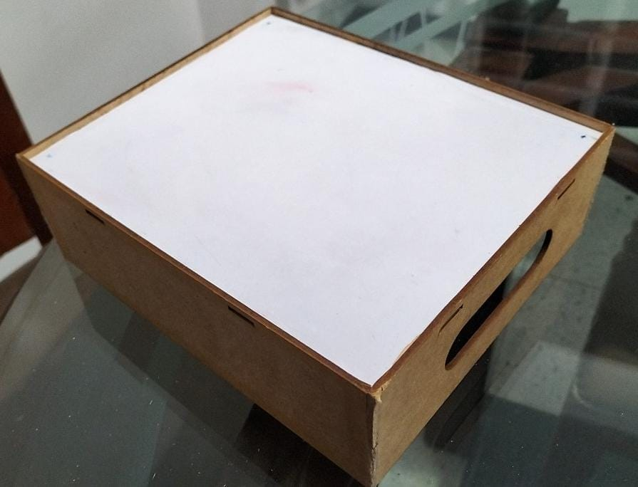

### Planos de la herramienta
Los planos de la herramienta se encuentran en [Planos](Planos/), mientras que los modelos CAD en inventor se encuentran en [Inventor](Inventor/)
## Diagrama de flujo de acciones del robot.
### Diagrama de flujo principal:

  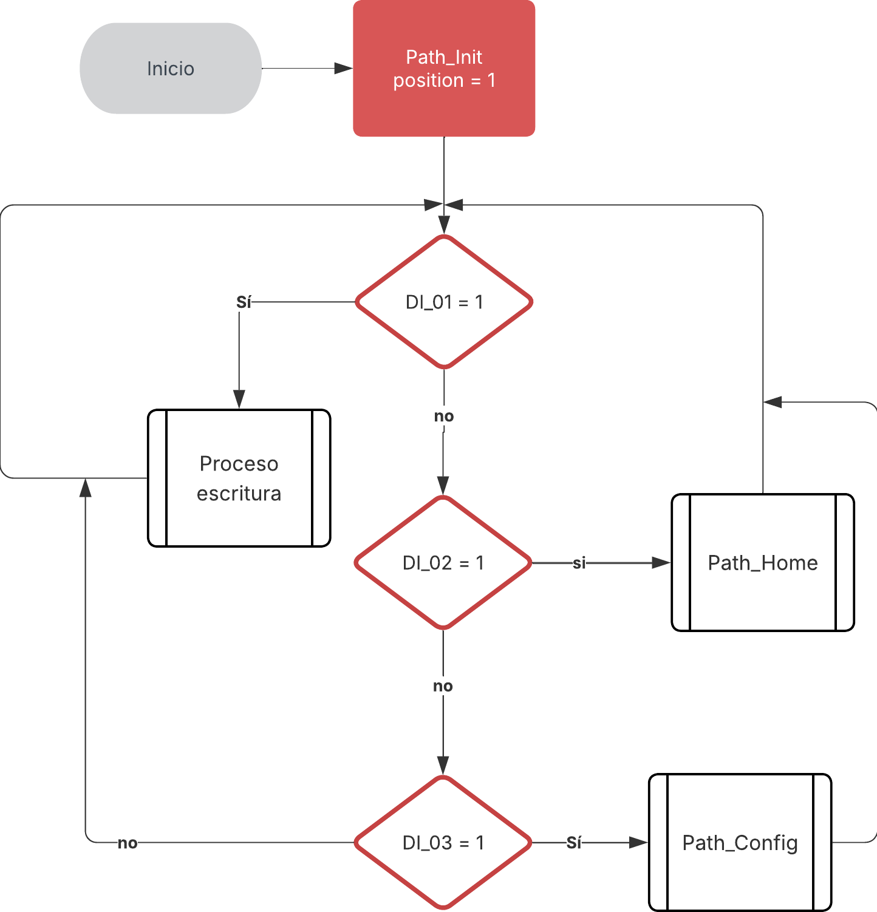

### Diagramas de flujo de los paths: 
**Proceso escritura**

  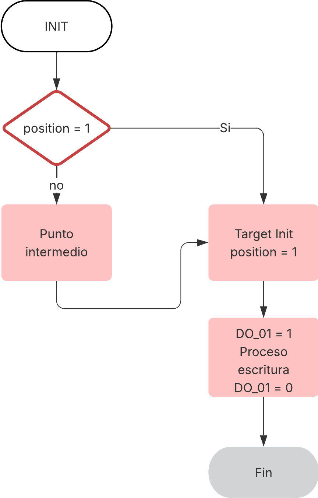

**Path Home**

  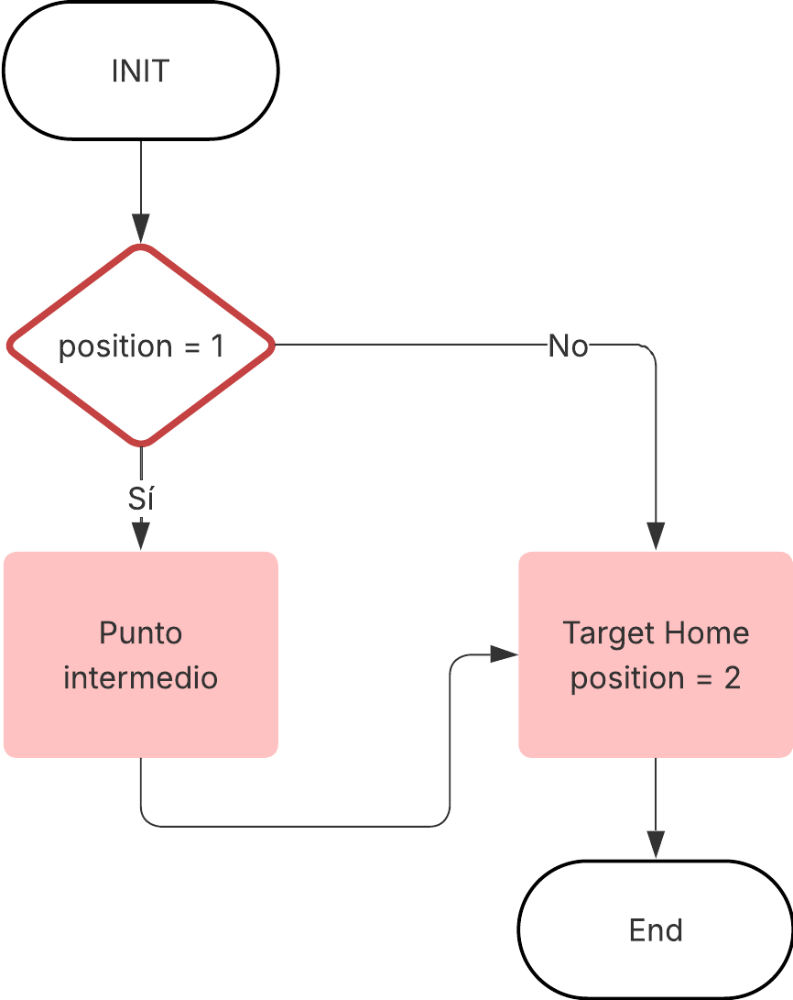

**Path Config**

  

### Funciones Utilizadas

#### Funciones y comandos en RAPID
Para el desarrollo principal de la práctica, se utilizaron funciones implementadas en RAPID, las cuales hicieron posible el funcionamiento secuencial del robot como se mostró en los diagramas anteriores.

##### Elementos:
Entre los elementos más utilizados se encuentran los siguientes:
- **tooldata Portamarcador:** La “herramienta” que usa el robot (punta). Incluye dónde está la punta y su peso.
- **wobjdata Workobject_1:** El “sistema de referencia” del trabajo. Le dice al robot dónde está la pieza/mesa.
- **robtarget Target_#*:** Puntos en el espacio a los que el robot debe ir (con posición y orientación).
- **jointtarget JointTarget_1:** Posición de las **juntas** del robot (ángulos) para ir a una postura segura o inicial.
- **num position:** Un número para contar o guardar estados simples.
- **Entradas/Salidas (DI_01, DI_02, DI_03, DO_01, Conveyor_INV, Conveyor_FWD):** Señales para encender/apagar cosas (por ejemplo, banda transportadora).
- **Parámetros de movimiento (v100, v200, z1, z100):**
    - **v100 / v200:** Velocidad.
    - **z1 / z100:** Qué tanto “suaviza” las esquinas al pasar por puntos (menos = más preciso, más = más suave/rápido).

##### Comandos
- **MoveJ:** Mueve el robot por dentro (por sus articulaciones). Rápido para ir de A a B sin seguir línea recta.
- **MoveL:** Mueve en línea recta entre dos puntos. Útil cuando la punta debe “dibujar” una línea.    
- **MoveC:** Mueve en arco/círculo pasando por puntos intermedios.
- **MoveAbsJ:** Va a una postura específica de juntas (como una “posición casa”).    
- **WaitTime t:** Espera “t” segundos (para sincronizar con algo externo).
- **Set / Reset:** Enciende / apaga una salida (por ejemplo, prender la banda).
- **IF / ELSEIF / ELSE / ENDIF:** “Si pasa esto, haz esto; si no, haz lo otro”.
- **WHILE / ENDWHILE:** Repite mientras se cumpla una condición.
- **Llamadas a procedimientos (`main`, `Path_#`):** Partes del programa que agrupan pasos (por ejemplo, “ir a home”, “hacer trayecto 1”, etc.).

#### Elementos utilizados en RobotStudio
Para la simulación en RobotStudio se implementaron distintos componentes que permiten tener una mejor visualización.

Se utilizó la herramienta de **Station Logic** para conectar las entradas y salidas del controlador con la herramienta SmartComponent que se muestra a continuación.

Se utilizo la herramienta de SmartComponent para simular el movimiento de la banda. En ella se utilizaron los siguientes elementos:
- **Entradas y salidas**: Aquí se simularon las entradas que tiene el controlador para activar/desactivar las señales de entrada. 
- **LinearMover**: Para mover el objeto que corresponde a la caja. En el se especificó la dirección del movimiento y la magnitud de la velocidad para que sea igual al de la caja, este valor es de aproximadamente 240 mm/s.
- **LogicGate**: Este bloque se utilizó para especificar que solo exista movimiento cuando las dos salidas del controlador están activas: **Conveyor_FWD y Conveyor_INV**.
### Código en Rapid

El código utilizado en RAPID se encuentra en la carpeta [Codigos](Codigos/) el archivo [Module1](Codigos/Module1.mod), así como los archivos de calibración de la herramienta [TCP tool2E2e](Codigos/TCP_tool2E2e.MOD) y del workobject [Wobj_work2E2e](Codigos/Wobj_work2E2e.MOD).

## Video de la simulación
El vídeo donde se muestra la simulación y las herramientas utilizadas de RobotStudio se encuentra en este link: [Grupo 2e - Simulación en Robot para decorar pasteles - Laboratorio No. 1](https://youtu.be/onNyF1kdBL0)

## Video de la implementación física
El vídeo de implementación física se encuentra en el siguiente link: [Grupo 2e - Implementación física Robot para decorar pasteles - Laboratorio No. 1](https://youtu.be/giggZgN50dI)

El resultado final de la decoración hecha por el robot se puede ver en la siguiente imagen:

  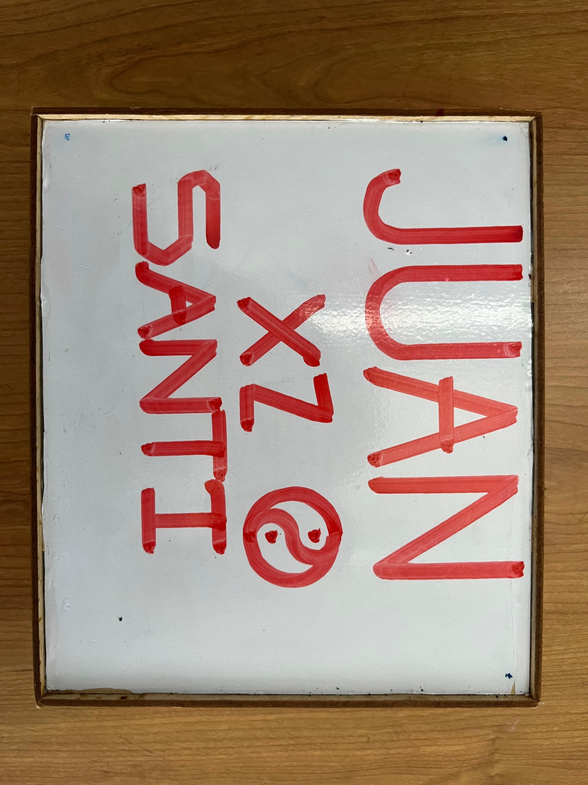

## Conclusiones
- Es necesario siempre tener consideraciones de seguridad para el manejo de robots industriales. La velocidad de un robot puede ser mayor que la reacción de las personas quienes lo controlan, lo cual puede generar daños incluso si se activo un botón de emergencia. La trayectoria que toma el robot debe tener en cuenta todos los objetos que lo rodean para evitar golpearlos en su recorrido. Se debe tener especial cuidado al realizar mantenimientos en la herramienta o el algún elemento del robot, su fuerza es mayor a la de cualquier humano y por eso es importante que estén quietos cuando se esté cerca de él; también es una alternativa llevar al robot a una posición segura cuando se desee realizar estos tipos de mantenimiento y que al operarlos, las personas no se encuentren en su espacio de trabajo.

- Las acciones hechas por el robot son completamente guiadas por el operador y el modulo que se cargue en el. Los robots no se conocen completamente ni el espacio que los rodea, por lo cual ellos no saben a que velocidad van, que objetos están tocando o que acción realizan a su alrededor. Por eso a la hora de programarlos, es importante tener en cuenta todo lo que hay en su alrededor y supervisar cada acción que realizan. Sus trayectorias puede cruzarse con algún componente, al escribir puede ser que lo hagan muy abajo, al moverse es posible incluso que se golpeen con ellos mismos. Para evitar todo esto existen las simulaciones y todas las herramientas de seguridad que están ya implementadas en el robot, se puede pausar una rutina antes de que el robot interactúe con otro objeto y detenerlo completamente si realiza movimientos no esperados.

