# Laboratorio No. 02 - Robótica Industrial - Análisis y Operación del Manipulador Motoman MH6.
## Integrantes

**Juan Angel Vargas Rodríguez**
juvargasro@unal.edu.co

**Santiago Mariño Cortés**
smarinoc@unal.edu.co

**Juan José Delgado Estrada**
judelgadoe@unal.edu.co

## Introducción

Los manipuladores industriales son herramientas clave en la automatización industrial. Cada modelo tiene sus propias características técnicas y configuraciones iniciales que los hacen ideales para diferentes aplicaciones. En este taller, se busca realizar una comparación técnica entre el manipulador Motoman MH6 y el ABB IRB140, comprender las configuraciones iniciales del Motoman MH6, explorar los diferentes modos de operación manual, y realizar simulaciones y ejecuciones reales de trayectorias usando RoboDK.


## Objetivos

 - Comprender las diferencias entre las características técnicas del manipulador Motoman MH6 y el IRB140. Identificar y describir las configuraciones iniciales del manipulador Motoman MH6, incluyendo el home1 y home2.
 - Realizar movimientos manuales del manipulador Motoman en distintos modos de operación (articulaciones, cartesianos, traslaciones y rotaciones).
 - Cambiar y controlar los niveles de velocidad para el movimiento manual del manipulador Motoman MH6.
 - Comprender las principales aplicaciones del software RoboDK y su comunicaci´on con el manipulador.
 - Comparar y analizar las diferencias entre RobotStudio y RoboDK.
 - Diseñar y ejecutar una trayectoria polar en RoboDK y realizar su implementación física en el manipulador Motoman.

## Configuraciones y características del manipulador Motoman MH6 y sus herramientas

### Comparación entre manipuladores IRB140 y Motoman MH6

*Ejes del Motoman MH6:*

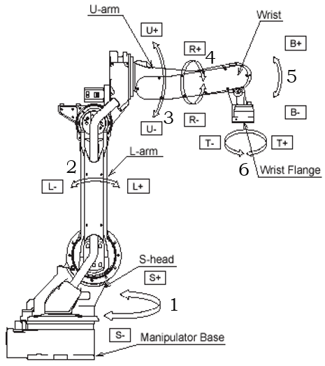

*Ejes del ABB 140:*

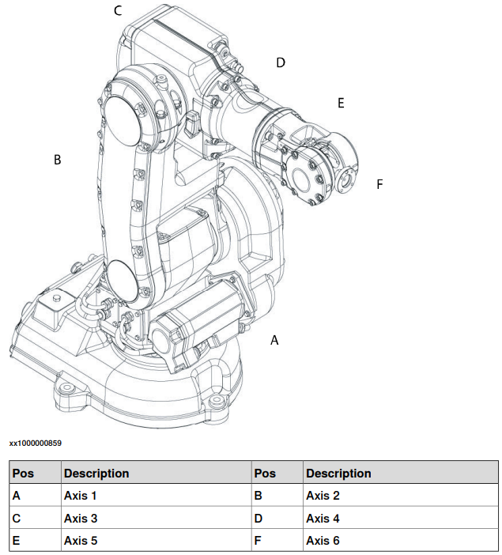

<div align="center">

| **Característica** | **Motoman MH6 (Yaskawa)** | **ABB IRB 140-6/0.8** |
|---------------------|---------------------------|-------------------------|
| **Fabricante** | Yaskawa Motoman | ABB Robotics |
| **Modelo** | MH6 | IRB 140-6/0.8 |
| **Carga útil máxima** | 6 kg | 6 kg |
| **Alcance máximo** | 1373 mm | 800 mm |
| **Número de ejes / Grados de libertad** | 6 | 6 |
| **Peso del manipulador** | 130 kg | 98 kg |
| **Velocidad máxima por eje** | E1: 220°/s<br>E2: 200°/s<br>E3: 220°/s<br>E4: 410°/s<br>E5: 410°/s<br>E6: 610°/s | E1: 200°/s<br>E2: 200°/s<br>E3: 260°/s<br>E4: 360°/s<br>E5: 360°/s<br>E6: 450°/s |
| **Rango de movimiento por eje** | E1: ±170°<br>E2: +155° a –90°<br>E3: +250° a –175°<br>E4: ±180°<br>E5: +225° a -45°<br>E6: ±360° | E1: ±180°<br>E2: +110° a –90°<br>E3: +50° a –230°<br>E4: ±200°<br>E5: ±115°<br>E6: ±400° |
| **Repetibilidad (precisión)** | ±0.08 mm | ±0.03 mm |
| **Aplicaciones comunes** | Ensamblaje, soldadura, manipulación de materiales, dispensado, manufactura aditiva, inspección visual. | Ensamblaje de precisión, laboratorio, manejo de piezas pequeñas, dispensado, pick and place, entornos de sala limpia o fundición. |


</div>


### Configuraciones iniciales del manipulador Motoman MH6


**Home 1**
<p align="center">

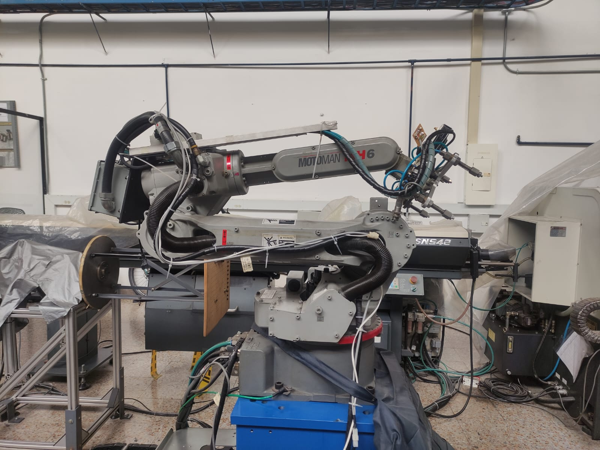

</p>
<div align="center">
  
|**Eje**|**Posición**|
|-------|------------|
|1|0 deg|
|2|88.6629 deg|
|3|-81.0787 deg|
|4|-0.0017 deg|
|5|51.7618 deg|
|6|-3.2709 deg|

</div>

En esta posición, el robot MH6 se encuentra completamente replegado o recogido, con los ejes articulados de forma compacta.
Esta configuración se utiliza principalmente para almacenamiento, transporte, ya que minimiza el espacio ocupado y reduce el riesgo de colisiones con el entorno.
Además, al mantener el brazo dentro de su radio mínimo de trabajo, se protege la integridad mecánica del manipulador y se facilita su mantenimiento o desconexión segura del sistema.

**Home 2**

<p align="center">
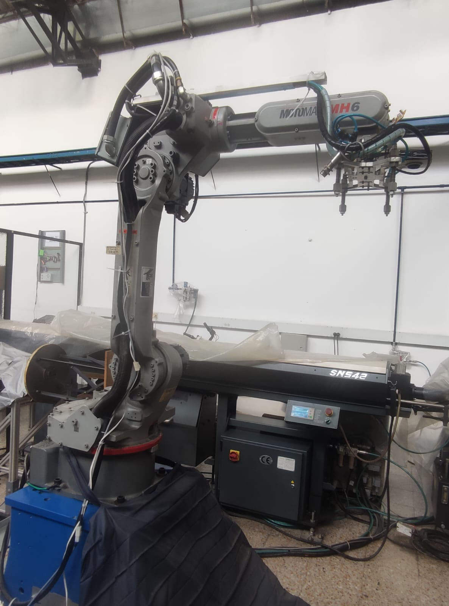
</p>

<div align="center">
  
|**Eje**|**Posición**|
|-------|------------|
|1|0 deg|
|2|-1.5665 deg|
|3|1.7135 deg|
|4|0 deg|
|5|-0.1468 deg|
|6|-3.2709 deg|
</div>

En esta posición, el robot MH6 adopta una postura extendida, con el brazo y el efector final orientados hacia el área de trabajo.
Esta configuración se considera el punto de partida ideal para operaciones de manipulación o movimientos automáticos, ya que ofrece una visión clara del entorno y una cinemática favorable para alcanzar distintas posiciones sin limitaciones articulares.
También puede emplearse como posición de referencia o inicio de trayectorias programadas, facilitando tanto la enseñanza manual como la ejecución de rutinas automáticas.

No existe una posición “mejor” que otra, cada configuración del robot cumple un propósito distinto.
La posición Home 1 (recogido) es ideal para almacenamiento, transporte o seguridad, mientras que la Home 2 (extendida) se usa como punto de partida para tareas de manipulación o enseñanza.
La elección depende del tipo de operación y del contexto de trabajo.


### Movimientos manuales

Para realizar movimientos de forma manual del robot se deben seguir los pasos que se describen a continuación:

1. Seleccionar el modo teach
2. Verificar que la para de emergencia no esté activa y si el botón está activado liberarlo
3. Activar los servos del robot con el botón SERVO ON READY
4. En la pantalla darle a la opción Robot
5. Segunda posición HOME
6. Presionar botón del hombre muerto
7. Presionar el botón de FORWARD
8. Verificar el estado del movimiento que va a realizar el robot en la pantalla
9. Presionar el botón COORD para cambiar el modo, si está en articular al presionarlo una vez cambia a coordenadas, 2 veces a quaterniones

#### Movimiento por coordenadas

10.
<p align="center">
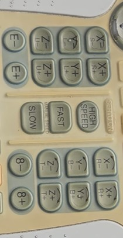
</p>

A la izquierda se encuentran los movimientos de traslación de los ejes x,y,z y a la derecha sus rotaciones respectivas. Presionar los botones de acuerdo al movimiento que se desee realizar, con los botones con el número 8 se puede mover esa articulación y con los que tienen la e indicada la 7

#### Movimiento articular

10. A continuación se muestra la numeración de las articulaciones, se debe presionar el botón correspondiente para el movimiento de cada una 
<p align="center">
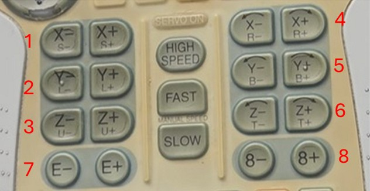
</p>


### Control de velocidad
Después de seguir los pasos del 1 al 4 se selecciona la velocidad a trabajar: HIGH SPEED, FAST, SLOW. En la pantalla en la parte superior señalada con rojo se puede observar en que modo está el robot actualmente: H,M,L. High Speed se refiere a una velocidad intermedia, Fast a un nivel intermedio y Slow a un nivel de velocidad bajo

<p align="center">
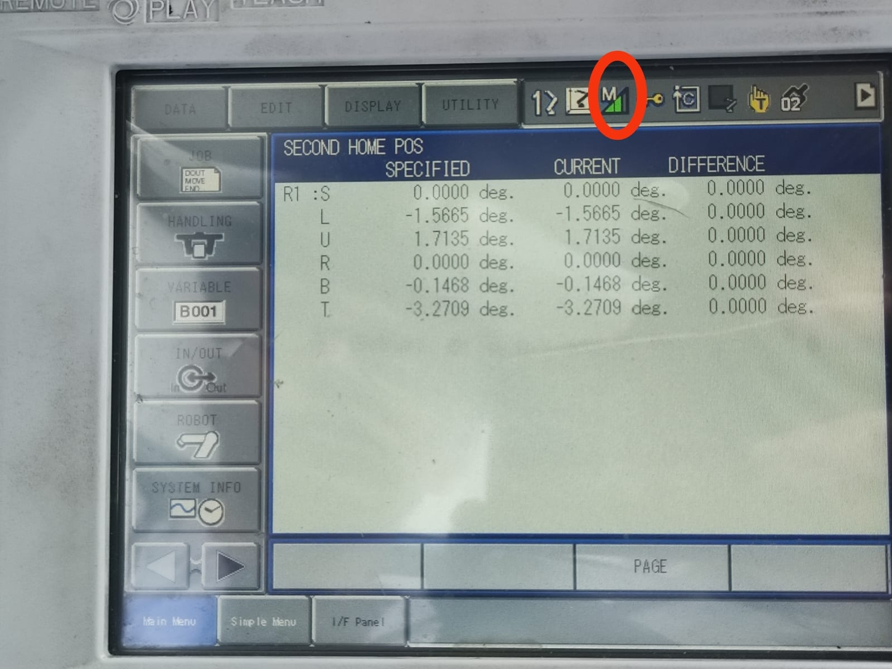
</p>


### Software RoboDK 

El software utilizado para esta práctica es RoboDK, un programa que permite simular y programar robots industriales en un entorno virtual. Se usa para planear trayectorias, probar rutinas y generar código para diferentes marcas de robots sin necesidad de tenerlos físicamente. También permite integrar herramientas, bandas transportadoras y procesos como soldadura, corte o ensamblaje dentro de una misma celda de trabajo. 
A continuación se muestra el panel general de RoboDK, en el se encuentran distintas opciones y funciones para desarrollar en este simulador:
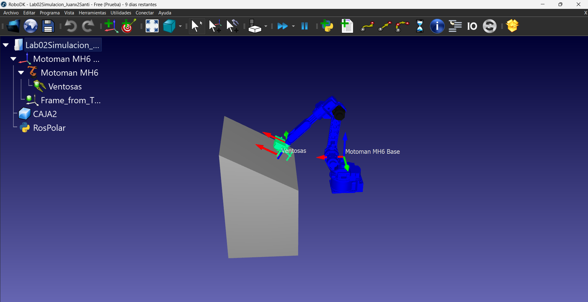


- Las primeras opciones que vemos en el panel son:
	
	Estas corresponden de izquierda a derecha a:
	- Cargar un archivo
	- Abrir biblioteca de robots
	- Guardar Estación
	- Deshacer y rehacer
- Las siguientes corresponden a la creación de targets y ajuste de vistas:
	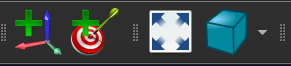
	- Añadir un sistema de referencia
	- Añadir un nuevo objetivo para el robot
	- Ajustar todo: para reubicar la vista del robot
	- Selección de vista

### Comparación de herramientas RoboDK y RobotStudio

#### RoboDK
Herramienta multimarca, flexible y extensible para simulación y programación offline; fuerte en integración de muchos modelos, scripting (Python) y generación de programas para distintos controladores.
  - **Ventajas:**
    - Compatibilidad multi-marca: soporte para decenas de fabricantes y modelos, por lo que sirve para entornos heterogéneos o para pruebas con distintos brazos.
    - Extensible y scriptable: API en Python y posibilidad de crear post-procesadores personalizados y plugins; ideal para automatización de flujos y para integrar CAM/CNC → robot.
    - Rápida puesta en marcha: interfaz orientada a generar programas offline con poco esfuerzo; buena para prototipado y pruebas conceptuales.
  - **Limitaciones:**
    - Fidelidad vs controlador real: aunque produce programas que funcionan en el robot real, la simulación no siempre reproduce exactamente el comportamiento del controlador del fabricante (pequeñas diferencias en cinemática, límites, comportamiento de control). Para validación final puede requerir ajustes y verificación en el controlador real.
    - Dependencia de post-procesadores: para generar código listo para el robot se necesitan post-procesadores correctos; si no existe uno perfecto para un controlador/versión concreta, será necesario crearlo o adaptarlo.
  - **Aplicaciones:**
    - Integraciones multi-marca (cuando tu célula tiene robots de distintos fabricantes).
    - Prototipado rápido, generación de trayectorias y post-procesado personalizado (p. ej. conversión de CAM a programas robot).
    - Escuelas, investigación y startups que necesitan flexibilidad y scripting en Python. 
#### RobotStudio
Herramienta propietaria ABB enfocada a simulación de alta fidelidad y programación offline para robots ABB (IRC5/RobotWare), con integración nativa, control virtual y simulación muy fiel al controlador real.
  - **Ventajas:**
    - Integración nativa con ABB (IRC5 / RobotWare): virtual controller y emulación que reproduce con alta fidelidad cómo el robot responderá en el mundo real (RAPID, I/O, señales, tiempos). Esto reduce riesgos al pasar a producción.
    - Alta fidelidad en trayectoria y tiempos de ciclo: modelos y física optimizados para validar trayectoria, verificación de colisiones y obtener estimaciones reales de tiempos.
    - Herramientas avanzadas de análisis: Signal Analyzer, Event Manager, verificación de I/O y conexión con controladores reales para pruebas integradas.
  - **Limitaciones:**
    - Enfoque propietario: optimizado para ABB; si trabajas con robots de otras marcas no es útil.
    - Costo y licencias: algunas funciones avanzadas (virtual controller, add-ins premium) pueden requerir licencias o módulos adicionales; hay conversas de usuarios sobre la curva de licenciamiento.
  - **Aplicaciones:**
    - Proyectos con robots ABB donde la fidelidad al controlador IRC5 es crítica: puesta en marcha virtual, verificación de colisiones, I/O y estimación de tiempos realistas.
    - Validación final de programas antes de subirlos a producción en sistemas ABB (reduce riesgos y tiempos de parada).    

## Desarrollo de práctica: Trayectoria polar

Para el desarrollo de la práctica se realizó primero la exploración del entorno de RoboDK y el movimiento de forma manual del manipulador del robot Motoman MH6 mediante el teach pendant, después de esto se procedió con la elaboración de un código para que el robot ejecutara una trayectoria, para esto se usó un  [Script de python](https://github.com/Juan-delgado1/Laboratorio-Rob-tica-2E/blob/75d58c01aad77d062bc4d28cf6bb98d9c7c7b7c5/Lab02/C%C3%B3digo/codigo%20lab2.py) que busca dibujar una trayectoria polar de tipo cardioide y los nombres de los integrantes del grupo ( Juan X2 Santi).

<p align="center">
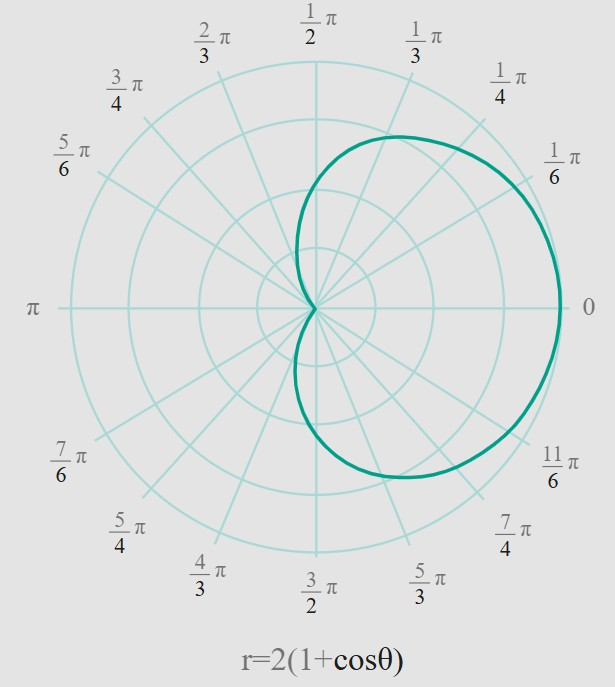
</p>

Resultado de la simulación

<p align="center">

</p>

Después de realizar la simulación se procedió a cargar el código en el robot y verificar la correcta ejecución de la rutina por parte del manipulador

### Diagrama de flujo de acciones del robot
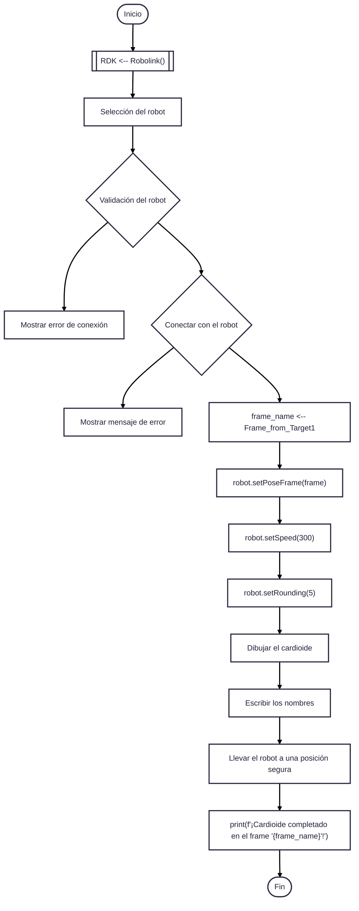

### Código desarrollado en RoboDK
[Código](https://github.com/Juan-delgado1/Laboratorio-Rob-tica-2E/blob/75d58c01aad77d062bc4d28cf6bb98d9c7c7b7c5/Lab02/C%C3%B3digo/codigo%20lab2.py)

```
from robodk.robolink import *    # API para comunicarte con RoboDK
from robodk.robomath import *    # Funciones matemáticas
import math
from matplotlib.textpath import TextPath
from matplotlib.patches import PathPatch
from matplotlib.transforms import Affine2D                   
 
```

### Plano de Planta
El siguiente plano de planta representa la disposición general del área de trabajo destinada a las prácticas con el robot industrial Motoman MH6.


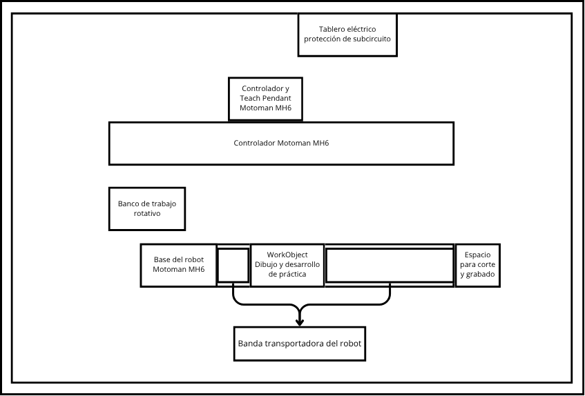


Como se puede observar, en la parte del fondo se ubica el tablero eléctrico de protección de subcircuito y el controlador del robot junto con el lugar para ubicar el Teach Pendant. En el centro se encuentra el controlador principal Motoman MH6, a un costado está el banco de trabajo rotativo, en la zona frontal se dispone la base del robot, el WorkObject para el dibujo y donde se desarrollo la práctica, el espacio destinado al corte y grabado y la banda transportadora que permite el movimiento del robot.
### Video de la simulación en RoboDK

El vídeo donde se muestra la simulación y las herramientas utilizadas de RoboDK se encuentra en este link: [Grupo 2E - Simulación de Laboratorio 2 con Manipulador Robot Motoman MH6](https://youtu.be/SNpgFyDXbFQ)


### Video de la implementación física con el manipulador Motoman MH6
El vídeo donde se muestra la implementación física de la práctica se encuentra en este link: [Grupo 2E - Implementación física de Laboratorio 2 con Manipulador Robot Motoman MH6](https://youtu.be/thkcGVQ2n2Q)

## Conclusiones


