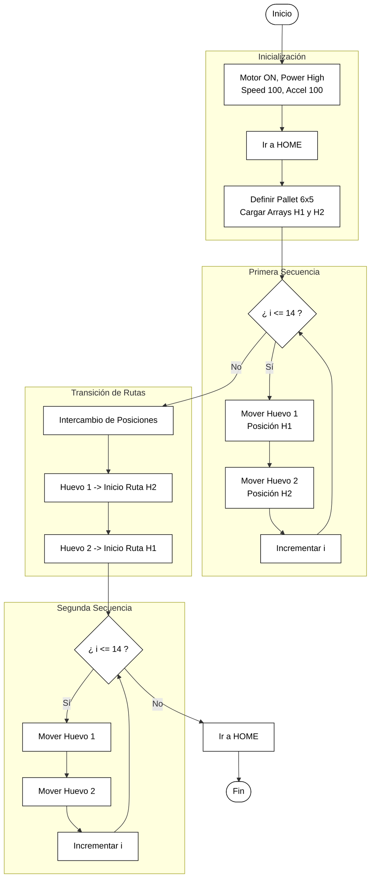

# Laboratorio No. 03- Robótica Industrial- Análisis y Operación del Manipulador EPSON T3-401S
## Integrantes

**Juan Angel Vargas Rodríguez**
juvargasro@unal.edu.co

**Santiago Mariño Cortés**
smarinoc@unal.edu.co

**Juan José Delgado Estrada**
judelgadoe@unal.edu.co

## Introducción
El presente laboratorio tiene como propósito familiarizar al estudiante con la operación y programación del manipulador SCARA EPSON T3-401S en un entorno cercano a una celda industrial real. A partir de la comparación con los robots Motoman MH6 y ABB IRB 140, se analizan sus diferencias en arquitectura, capacidades y aplicaciones típicas. Posteriormente, se trabaja con el software EPSON RC+ 7.0 para configurar el sistema, definir la posición de Home, realizar movimientos manuales en distintos modos (articular y cartesiano) y ajustar parámetros de velocidad. Finalmente, se diseña un gripper neumático y se implementa una tarea de paletizado de dos esferas sobre un panal de huevos, integrando conceptos de programación, trayectoria y operación segura del manipulador.


## Objetivos

 - Comprender las diferencias entre las características técnicas del manipulador EPSON T3-401S. 
 - Identificar y describir las configuraciones iniciales del manipulador EPSON T3-401S, incluyendo la definición de la posición de Home. 
 - Realizar movimientos manuales del manipulador EPSON T3-401S en distintos modos de operación (articulaciones, cartesianos, traslaciones y rotaciones). 
 - Cambiar y controlar los niveles de velocidad para el movimiento manual del manipulador EPSON T3-401S. 
 - Comprender las principales aplicaciones del software EPSON RC+ 7.0 y su comunicación con el manipulador. 
 - Comparar y analizar las diferencias entre RobotStudio, RoboDK y EPSON RC+ 7.0. 
 - Diseñar un gripper neumático que permita la manipulación de objetos en el espacio de trabajo del robot EPSON T3-401S. 
 - Diseñar y ejecutar una trayectoria en el software EPSON RC+ 7.0 y realizar su implementación física en el manipulador EPSON T3-401S.

## Configuraciones y características del manipulador EPSON T3-401S y sus herramientas

### Características técnicas de los manipuladores IRB140, Motoman MH6 y EPSON T3-401S

*Ejes del EPSON T3-401S*


*Ejes del Motoman MH6:*


*Ejes del ABB 140:*


<div align="center">

| **Característica** | **Motoman MH6 (Yaskawa)** | **ABB IRB 140-6/0.8** | **EPSON T3-401S** |
|---------------------|---------------------------|------------------------|--------------------|
| **Fabricante** | Yaskawa Motoman | ABB Robotics | Epson Robotics |
| **Modelo** | MH6 | IRB 140-6/0.8 | T3-401S |
| **Carga útil máxima** | 6 kg | 6 kg | 3 kg |
| **Alcance máximo** | 1373 mm | 800 mm | 400 mm (alcance horizontal) |
| **Número de ejes / Grados de libertad** | 6 | 6 | 4 (SCARA) |
| **Peso del manipulador** | 130 kg | 98 kg | 16 kg aprox. |
| **Velocidad máxima por eje** | E1: 220°/s<br>E2: 200°/s<br>E3: 220°/s<br>E4: 410°/s<br>E5: 410°/s<br>E6: 610°/s | E1: 200°/s<br>E2: 200°/s<br>E3: 260°/s<br>E4: 360°/s<br>E5: 360°/s<br>E6: 450°/s | E1–E2 (XY): 3700 mm/s<br>E3 (Z): 1000 mm/s<br>E4: 2600°/s |
| **Rango de movimiento por eje** | E1: ±170°<br>E2: +155° a –90°<br>E3: +250° a –175°<br>E4: ±180°<br>E5: +225° a -45°<br>E6: ±360° | E1: ±180°<br>E2: +110° a –90°<br>E3: +50° a –230°<br>E4: ±200°<br>E5: ±115°<br>E6: ±400° | E1: ±132°<br>E2: ±141°<br>E3: 150 mm (carrera Z)<br>E4: ±360° |
| **Repetibilidad (precisión)** | ±0.08 mm | ±0.03 mm | ±0.02 mm |
| **Aplicaciones comunes** | Ensamblaje, soldadura, manipulación de materiales, dispensado, manufactura aditiva, inspección visual. | Ensamblaje de precisión, laboratorio, manejo de piezas pequeñas, dispensado, pick and place, entornos de sala limpia o fundición. | Pick and place, alimentación de piezas, ensamblaje ligero, inspección, automatización de procesos donde antes se usaban guías lineales. |


</div>


### Configuraciones iniciales del manipulador EPSON T3-401S


**Home**
<p align="center">


</p>
<div align="center">
  
|**Eje**|**Posición**|
|-------|------------|
|1|0 deg|
|2|0 deg|
|3|0 mm|
|4|0 deg|


</div>

En esta posición, el robot se encuentra completamente estirado, con sus articulaciones rotacionales en 0 grados y la prismática en su punto más alto. Esto implica que los ejes 1 y 2 del SCARA están alineados entre sí y orientados hacia el frente del robot, de modo que el brazo queda extendido en la dirección del eje X positivo. El eje Z (articulación prismática) se ubica en su posición superior de seguridad, mientras que el eje 4 de rotación de la herramienta también se fija en 0°, alineando el efector final con la orientación base del manipulador.


### Movimientos manuales

Para el control del robot se utiliza únicamente el software EPSON RC+ 7.0, por lo tanto para que el robot pueda realizar algún movimiento, deben ser desde un computador que tenga instalada este programas. Para realizar movimientos de forma manual del robot se deben seguir los pasos que se describen a continuación:

1. Para visualizar el robot en el software, seleccionar *Simulator* o oprimir las teclas *Ctrl+F5*. 
2. Verificar cual controlador tiene el software. 
   - Para está practica se conectará el robot con el computador mediante un cable USB, por lo tanto la conexión del controlador debe decir USB.
   - Si solo se va a realizar una simulación, se selecciona *Sin conexión*.
3. Verificar que la para de emergencia no esté activa y si el botón está activado liberarlo
4. Dirigirse a **Robot Manager** 
5. En la pestaña **Panel de control**, seleccionar **Motores ON**
   - Observar en que nivel de potencia está, si HIGH o LOW. Seleccionar el que se ajuste más a la aplicación que se quiere realizar. Para esta práctica se mantendrá en POWER LOW.
   
	 <p align="center">
		
		</p>
5. Ahora en la pestaña de Mover y Enseñar podemos seleccionar si mover las articulaciones o en ejes cartesianos. 
   - En esta pestaña aparecen los botones para mover cada elemento que se requiere en un sentido o en otro. Por ejemplo, en la imagen a continuación se muestran los movimientos por articulación donde aparecen 8 botones para el movimiento de cada articulación en un sentido o en otro.
   <p align="center">
		
		</p>


### Control de velocidad

1. La **velocidad de referencia** del robot se define en el **código** mediante la instrucción `SPEED n`, donde _n_ es un valor entre 1 y 100 que corresponde a un porcentaje de la velocidad máxima del manipulador.
2. Para los **movimientos manuales (jog)**, la velocidad no se ajusta con un valor numérico, sino seleccionando en la ventana de **Mover y Enseñar** si se trabaja con velocidad **BAJA (LOW)** o **ALTA (HIGH)**.
3. La opción **LOW** limita la velocidad y es adecuada para aproximaciones seguras y enseñanza de puntos, mientras que **HIGH** permite movimientos más rápidos cuando el área de trabajo está despejada; el nivel activo se identifica porque en la interfaz aparece claramente indicado si la velocidad seleccionada es baja o alta.
### Software EPSON RC+ 7.0

1. **EPSON RC+ 7.0 como entorno de desarrollo y supervisión**   
    - Permite crear, editar y depurar programas en lenguaje **SPEL+**.        
    - Gestiona proyectos del robot: archivos de programa, librerías y configuraciones asociadas.
    - Configura parámetros del sistema: marcos de referencia, entradas y salidas digitales, velocidades, aceleraciones y límites de trabajo.
    - Ofrece herramientas de simulación de trayectorias para verificar movimientos antes de ejecutarlos sobre el manipulador real.
    - Permite monitorizar en tiempo real el estado del controlador y del manipulador (posiciones, errores, alarmas, etc.).
        
2. **Comunicación entre EPSON RC+ 7.0 y el manipulador T3-401S**    
    - El software se ejecuta en un **PC con Windows** y se conecta al controlador integrado del T3 mediante **USB o Ethernet**, según la configuración seleccionada.        
    - A través de este enlace se envían programas compilados, parámetros de configuración y órdenes de movimiento.        
    - El controlador devuelve al PC información de posición, estado de los ejes, señales de E/S, alarmas y mensajes de error.        
    - La configuración establecida desde EPSON RC+ queda almacenada en el controlador, permitiendo que el robot ejecute los programas incluso sin la intervención constante del PC.
        
3. **Procesos que realiza para ejecutar movimientos**
    
    - El usuario puede enseñar puntos y trayectorias desde la ventana de **Mover y Enseñar (Jog & Teach)** o definirlos directamente en el código SPEL+.        
    - EPSON RC+ organiza estos puntos dentro de programas y, al iniciar la ejecución, los **descarga al controlador del robot** junto con los parámetros de movimiento (velocidad, tipo de trayectoria, etc.).        
    - El controlador se encarga de realizar los cálculos cinemáticos, planificar la trayectoria y generar la interpolación entre puntos.        
    - Durante esta ejecución se respetan los límites de velocidad, aceleración, rango articular y el modo de operación activo (Teach, Test o Auto).
        
4. **EPSON RC+ 7.0 como interfaz de supervisión y control en tiempo real**    
    - Permite **arrancar, pausar y detener** programas directamente desde la interfaz gráfica.        
    - Facilita el ajuste de parámetros en tiempo real, como la velocidad de referencia utilizada durante la ejecución.        
    - Muestra el avance del programa, la posición actual del robot y, en caso de utilizar el simulador, una visualización gráfica del movimiento.        
    - Gestiona condiciones de seguridad: estado de los motores (ON/OFF), nivel de potencia (LOW/HIGH), paros de emergencia y mensajes de error.        
    - De esta forma, asegura que los comandos enviados al manipulador se ejecuten de manera controlada, segura y trazable para el operador.


### Comparación de herramientas RoboDK, RobotStudio y EPSON RC+ 7.0

| **Herramienta**   | **Descripción general**                                                                                                                                                                                           | **Ventajas**                                                                                                                                                                                                                                                                                                                                                                                                       | **Limitaciones**                                                                                                                                                                                                                                                                                                  | **Aplicaciones**                                                                                                                                                                                                                                                                                                                                                                 |
| ----------------- | ----------------------------------------------------------------------------------------------------------------------------------------------------------------------------------------------------------------- | ------------------------------------------------------------------------------------------------------------------------------------------------------------------------------------------------------------------------------------------------------------------------------------------------------------------------------------------------------------------------------------------------------------------ | ----------------------------------------------------------------------------------------------------------------------------------------------------------------------------------------------------------------------------------------------------------------------------------------------------------------- | -------------------------------------------------------------------------------------------------------------------------------------------------------------------------------------------------------------------------------------------------------------------------------------------------------------------------------------------------------------------------------- |
| **RoboDK**        | Herramienta multimarca, flexible y extensible para simulación y programación offline, con énfasis en integración de muchos modelos, scripting en Python y generación de programas para distintos controladores.   | • Compatibilidad multi-marca: soporte para muchos fabricantes y modelos, ideal para celdas heterogéneas.• Extensible y scriptable: API en Python, creación de post-procesadores y plugins para automatizar flujos e integrar CAM/CNC → robot.• Rápida puesta en marcha y prototipado: interfaz orientada a generar programas offline con poco esfuerzo.                                                            | • La simulación no siempre reproduce al 100 % el comportamiento del controlador real; puede requerir ajustes en el robot físico.• Dependencia de post-procesadores: si no existe uno adecuado para un controlador/versión, hay que adaptarlo o desarrollarlo.                                                     | • Integraciones multi-marca en celdas con varios fabricantes.• Prototipado rápido de trayectorias, conversión CAM→robot y post-procesado personalizado.• Docencia, investigación y startups que requieren flexibilidad y scripting en Python.                                                                                                                                    |
| **RobotStudio**   | Herramienta propietaria de ABB para simulación de alta fidelidad y programación offline de robots ABB (IRC5/RobotWare), con controlador virtual y emulación cercana al comportamiento real.                       | • Integración nativa con controladores ABB (IRC5/RobotWare), incluyendo virtual controller y compatibilidad completa con RAPID, I/O y señales.• Alta fidelidad de trayectoria y tiempos de ciclo, con buenas herramientas de verificación de colisiones.• Herramientas avanzadas de análisis y depuración (Signal Analyzer, Event Manager, etc.) y conexión con controladores reales.                              | • Enfoque propietario: solo útil para robots ABB, no sirve para otras marcas.• Coste y licenciamiento: algunas funciones avanzadas requieren módulos o licencias adicionales.                                                                                                                                     | • Proyectos donde se usan robots ABB y se necesita alta fidelidad respecto al controlador real.• Puesta en marcha virtual, verificación de colisiones e I/O y estimación de tiempos de ciclo antes de producción.• Validación final de programas antes de cargarlos en sistemas ABB en planta.                                                                                   |
| **EPSON RC+ 7.0** | Entorno propietario de Epson para programación, simulación básica y supervisión de robots EPSON (como el T3-401S), que integra editor SPEL+, gestor de proyectos y herramientas de configuración del controlador. | • Integración directa con el controlador EPSON: comunicación por USB/Ethernet sin necesidad de post-procesadores intermedios.• Alta coherencia entre simulación y ejecución real, ya que usa el propio entorno del fabricante y sus modelos cinemáticos oficiales.• Incluye herramientas específicas para enseñanza de puntos, configuración de I/O, ajuste de parámetros de movimiento y diagnóstico del sistema. | • Enfoque propietario: solo funciona con robots EPSON, no es válido para otras marcas.• Menos orientado a entornos multi-marca o a flujos complejos de CAM que herramientas como RoboDK.• El scripting y la automatización están centrados en SPEL+ y el ecosistema EPSON, con menor flexibilidad multi-lenguaje. | • Programación y puesta en marcha de celdas con robots EPSON (p. ej., T3-401S).• Enseñanza de trayectorias, ajuste fino de velocidades, potencias y secuencias de I/O directamente sobre el controlador real o en simulación.• Entornos industriales donde se valora la integración nativa con el hardware EPSON y la reducción de riesgos al transferir programas a producción. |

## Desarrollo de práctica: Paletizado de 2 esferas en un panal de huevos

### Planos de la herramienta
Los planos de la herramienta se encuentran en [Planos](Planos/),

## Plano de planta
A continuación se muestran las posiciones iniciales de la cubeta, el manipulador y los huevos.

	 <p align="center">
		
		</p>


### Programación

**Diagrama de bloques del código:**



**Descripción del Algoritmo de Control y Trayectoria:**

El programa, desarrollado en el entorno Epson RC+ 7.0, controla un brazo robótico encargado de manipular dos objetos ("huevos") dentro de una superficie paletizada definida como una matriz de 6x5 posiciones (30 puntos en total). El ciclo inicia con la configuración de los parámetros cinemáticos del robot (potencia alta, aceleración y velocidad al 100%) y el posicionamiento en Home.

La lógica central se apoya en la definición de un Pallet y dos vectores globales (H1 y H2) que almacenan una secuencia precalculada de índices. Estos índices representan las coordenadas espaciales que cada huevo debe visitar respetando el movimiento en "L" (tipo caballo de ajedrez).

El proceso de manipulación, encapsulado en la función Movimiento_huevos, opera mediante un bucle iterativo. En cada iteración, el robot ejecuta una secuencia de Pick-and-Place (coger y dejar): primero desplaza el Huevo 1 de su posición actual (i-1) a la siguiente (i) en el vector H1, y seguidamente realiza la misma operación para el Huevo 2 utilizando el vector H2. El control de la herramienta (pinza) se gestiona mediante lógica negativa en la salida Out_9.

Al finalizar la primera secuencia de 14 movimientos, el sistema ejecuta una rutina de transición donde el Huevo 1 se traslada al punto de inicio de la ruta del Huevo 2, y viceversa, permitiendo que ambos objetos intercambien sus trayectorias o completen el recorrido total de la matriz en un segundo ciclo de bucle idéntico al primero.


[Código](https://github.com/Juan-delgado1/Laboratorio-Rob-tica-2E/blob/6ebdc937786b314adc7951cdcb2fe664746063fa/Lab03/C%C3%B3digos/Paletizado_huevos.prg)

```vb
Global Integer i
Global Integer H1(14)
Global Integer H2(14)

Function Grip_On       ' activar pinza (lógica NEGATIVA: activo = nivel bajo)
    Off Out_9
Fend

Function Grip_Off      ' desactivar pinza (lógica NEGATIVA: inactivo = nivel alto)
    On Out_9
Fend

Function main
	Motor On
	Power Low
	Accel 100, 100 '%
	Speed 100 '%	
	Grip_Off()
	Home
	Call Paletizado_01
	Call Movimiento_huevos()
	Home
Fend
...
```

### Video de la simulación en EPSON RC+ 7.0

El vídeo donde se muestra la simulación y las herramientas utilizadas de EPSON RC+7.0 se encuentra en este link: [Grupo 2E - Simulación de Laboratorio 3 con Manipulador EPSON T3-401S](https://youtu.be/uz3ZTg-uTo8?si=OGDmg9CCw3jylUJw)


### Video de la implementación física con el manipulador EPSON T3-401S
El vídeo donde se muestra la implementación física de la práctica se encuentra en este link: [Grupo 2E - Implementación física de Laboratorio 3 con Manipulador EPSON T3-401S](https://youtu.be/0OPY-gkM478?si=EnLo-ygpki_pwg9B)

## Conclusiones
El desarrollo del laboratorio permitió comprender de forma práctica las diferencias entre un robot SCARA como el EPSON T3-401S y manipuladores industriales de seis grados de libertad (Motoman MH6 y ABB IRB 140), tanto en su estructura mecánica como en su rango de aplicaciones. El uso de EPSON RC+ 7.0 facilitó la configuración del robot, la enseñanza de puntos y la ejecución de trayectorias, evidenciando la importancia de la posición de Home, los modos de operación y el ajuste de velocidades para garantizar movimientos seguros. El diseño del gripper neumático y la programación de la rutina de paletizado sobre el panal de huevos integraron conceptos de planificación de tareas, lógica de control y manipulación de objetos, reforzando la relación entre la teoría de robótica industrial y su implementación en un entorno experimental real.


