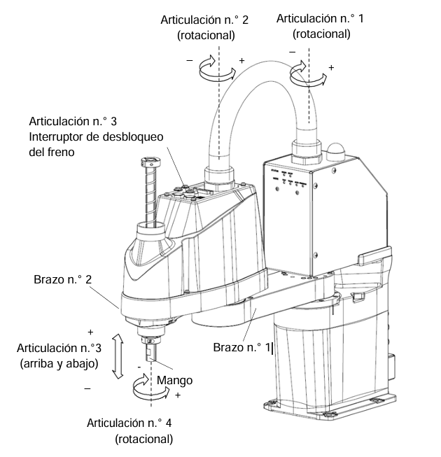
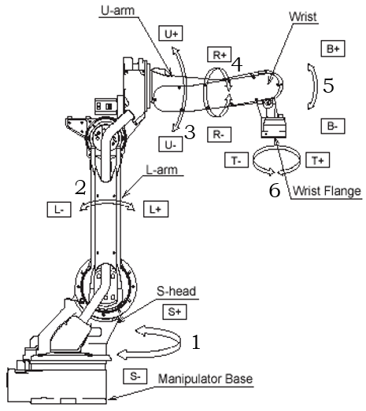
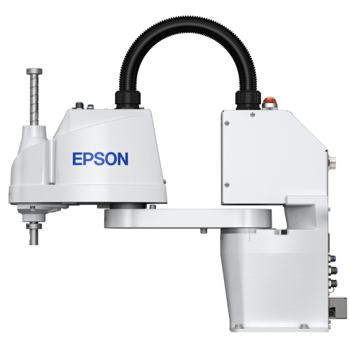
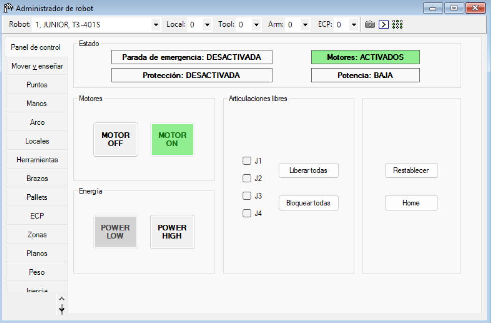
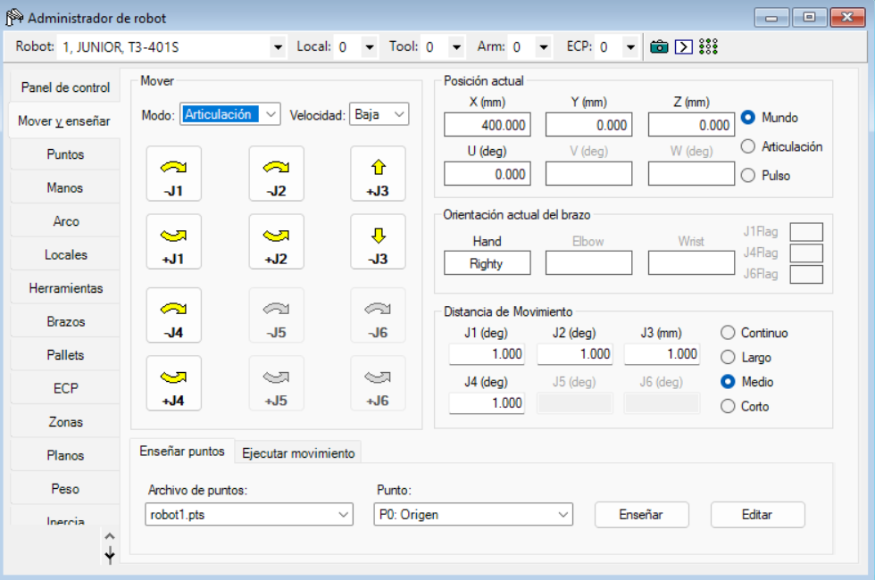
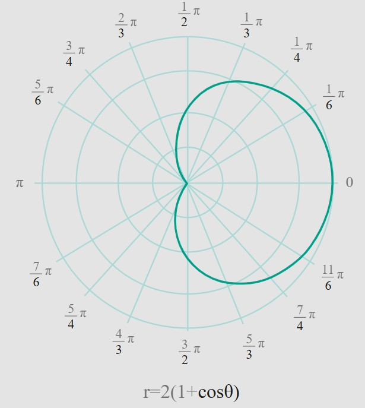
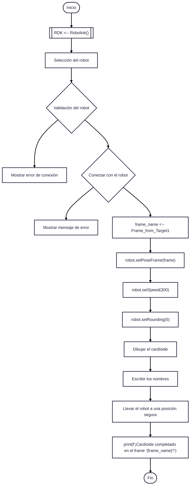
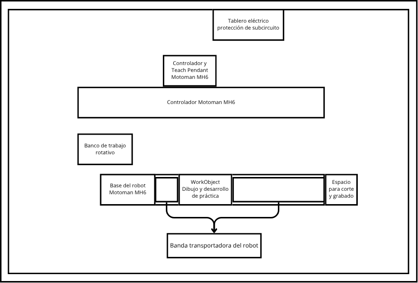

# Laboratorio No. 03- Robótica Industrial- Análisis y Operación del Manipulador EPSON T3-401S
## Integrantes

**Juan Ángel Vargas Rodríguez**
juvargasro@unal.edu.co

**Santiago Mariño Cortés**
smarinoc@unal.edu.co

**Juan José Delgado Estrada**
judelgadoe@unal.edu.co

## Introducción


## Objetivos

 - Comprender las diferencias entre las características técnicas del manipulador EPSON T3-401S. 
 - Identificar y describir las configuraciones iniciales del manipulador EPSON T3-401S, incluyendo la definición de la posición de Home. 
 - Realizar movimientos manuales del manipulador EPSON T3-401S en distintos modos de operación (articulaciones, cartesianos, traslaciones y rotaciones). 
 - Cambiar y controlar los niveles de velocidad para el movimiento manual del manipulador EPSON T3-401S. 
 - Comprender las principales aplicaciones del software EPSON RC+ 7.0 y su comunicación con el manipulador. 
 - Comparar y analizar las diferencias entre RobotStudio, RoboDK y EPSON RC+ 7.0. 
 - Diseñar un gripper neumático que permita la manipulación de objetos en el espacio de trabajo del robot EPSON T3-401S. 
 - Diseñar y ejecutar una trayectoria en el software EPSON RC+ 7.0 y realizar su implementación física en el manipulador EPSON T3-401S.

## Configuraciones y características del manipulador EPSON T3-401S y sus herramientas

### Características técnicas de los manipuladores IRB140, Motoman MH6 y EPSON T3-401S

*Ejes del EPSON T3-401S*





*Ejes del Motoman MH6:*



*Ejes del ABB 140:*


<div align="center">

| **Característica** | **Motoman MH6 (Yaskawa)** | **ABB IRB 140-6/0.8** | **EPSON T3-401S** |
|---------------------|---------------------------|------------------------|--------------------|
| **Fabricante** | Yaskawa Motoman | ABB Robotics | Epson Robotics |
| **Modelo** | MH6 | IRB 140-6/0.8 | T3-401S |
| **Carga útil máxima** | 6 kg | 6 kg | 3 kg |
| **Alcance máximo** | 1373 mm | 800 mm | 400 mm (alcance horizontal) |
| **Número de ejes / Grados de libertad** | 6 | 6 | 4 (SCARA) |
| **Peso del manipulador** | 130 kg | 98 kg | 16 kg aprox. |
| **Velocidad máxima por eje** | E1: 220°/s<br>E2: 200°/s<br>E3: 220°/s<br>E4: 410°/s<br>E5: 410°/s<br>E6: 610°/s | E1: 200°/s<br>E2: 200°/s<br>E3: 260°/s<br>E4: 360°/s<br>E5: 360°/s<br>E6: 450°/s | E1–E2 (XY): 3700 mm/s<br>E3 (Z): 1000 mm/s<br>E4: 2600°/s |
| **Rango de movimiento por eje** | E1: ±170°<br>E2: +155° a –90°<br>E3: +250° a –175°<br>E4: ±180°<br>E5: +225° a -45°<br>E6: ±360° | E1: ±180°<br>E2: +110° a –90°<br>E3: +50° a –230°<br>E4: ±200°<br>E5: ±115°<br>E6: ±400° | E1: ±132°<br>E2: ±141°<br>E3: 150 mm (carrera Z)<br>E4: ±360° |
| **Repetibilidad (precisión)** | ±0.08 mm | ±0.03 mm | ±0.02 mm |
| **Aplicaciones comunes** | Ensamblaje, soldadura, manipulación de materiales, dispensado, manufactura aditiva, inspección visual. | Ensamblaje de precisión, laboratorio, manejo de piezas pequeñas, dispensado, pick and place, entornos de sala limpia o fundición. | Pick and place, alimentación de piezas, ensamblaje ligero, inspección, automatización de procesos donde antes se usaban guías lineales. |


</div>


### Configuraciones iniciales del manipulador EPSON T3-401S


**Home**
<p align="center">



</p>
<div align="center">
  
|**Eje**|**Posición**|
|-------|------------|
|1|0 deg|
|2|0 deg|
|3|0 mm|
|4|0 deg|


</div>

En esta posición, el robot se encuentra completamente estirado, con sus articulaciones rotacionales en 0 grados y la prismática en su punto más alto. Esto implica que los ejes 1 y 2 del SCARA están alineados entre sí y orientados hacia el frente del robot, de modo que el brazo queda extendido en la dirección del eje X positivo. El eje Z (articulación prismática) se ubica en su posición superior de seguridad, mientras que el eje 4 de rotación de la herramienta también se fija en 0°, alineando el efector final con la orientación base del manipulador.


### Movimientos manuales

Para el control del robot se utiliza únicamente el software EPSON RC+ 7.0, por lo tanto para que el robot pueda realizar algún movimiento, deben ser desde un computador que tenga instalada este programas. Para realizar movimientos de forma manual del robot se deben seguir los pasos que se describen a continuación:

1. Para visualizar el robot en el software, seleccionar *Simulator* o oprimir las teclas *Ctrl+F5*. 
2. Verificar cual controlador tiene el software. 
   - Para está practica se conectará el robot con el computador mediante un cable USB, por lo tanto la conexión del controlador debe decir USB.
   - Si solo se va a realizar una simulación, se selecciona *Sin conexión*.
3. Verificar que la para de emergencia no esté activa y si el botón está activado liberarlo
4. Dirigirse a **Robot Manager** 
5. En la pestaña **Panel de control**, seleccionar **Motores ON**
   - Observar en que nivel de potencia está, si HIGH o LOW. Seleccionar el que se ajuste más a la aplicación que se quiere realizar. Para esta práctica se mantendrá en POWER LOW.
   
	 <p align="center">
		
		</p>
5. Ahora en la pestaña de Mover y Enseñar podemos seleccionar si mover las articulaciones o en ejes cartesianos. 
   - En esta pestaña aparecen los botones para mover cada elemento que se requiere en un sentido o en otro. Por ejemplo, en la imagen a continuación se muestran los movimientos por articulación donde aparecen 8 botones para el movimiento de cada articulación en un sentido o en otro.
   <p align="center">
		
		</p>
     
1. Verificar que la para de emergencia no esté activa y si el botón está activado liberarlo
2. Activar los servos del robot con el botón SERVO ON READY
3. En la pantalla darle a la opción Robot
4. Segunda posición HOME
5. Presionar botón del hombre muerto
6. Presionar el botón de FORWARD
7. Verificar el estado del movimiento que va a realizar el robot en la pantalla
8. Presionar el botón COORD para cambiar el modo, si está en articular al presionarlo una vez cambia a coordenadas, 2 veces a quaterniones

#### Movimiento por coordenadas

10.
<p align="center">

</p>

A la izquierda se encuentran los movimientos de traslación de los ejes x,y,z y a la derecha sus rotaciones respectivas. Presionar los botones de acuerdo al movimiento que se desee realizar, con los botones con el número 8 se puede mover esa articulación y con los que tienen la e indicada la 7

#### Movimiento articular

10. A continuación se muestra la numeración de las articulaciones, se debe presionar el botón correspondiente para el movimiento de cada una 
<p align="center">

</p>


### Control de velocidad
Después de seguir los pasos del 1 al 4 se selecciona la velocidad a trabajar: HIGH SPEED, FAST, SLOW. En la pantalla en la parte superior señalada con rojo se puede observar en que modo está el robot actualmente: H,M,L. High Speed se refiere a una velocidad intermedia, Fast a un nivel intermedio y Slow a un nivel de velocidad bajo

<p align="center">

</p>


### Software RoboDK 

El software utilizado para esta práctica es RoboDK, un programa que permite simular y programar robots industriales en un entorno virtual. Se usa para planear trayectorias, probar rutinas y generar código para diferentes marcas de robots sin necesidad de tenerlos físicamente. También permite integrar herramientas, bandas transportadoras y procesos como soldadura, corte o ensamblaje dentro de una misma celda de trabajo. 
A continuación se muestra el panel general de RoboDK, en el se encuentran distintas opciones y funciones para desarrollar en este simulador:


#### Funciones del panel general

- Las primeras opciones que vemos en el panel son:
	
	
	
	Estas corresponden de izquierda a derecha a:
	- Cargar un archivo.
	- Abrir biblioteca de robots.
	- Guardar Estación.
	- Deshacer y rehacer.
- Las siguientes corresponden a la creación de targets y ajuste de vistas:
	
	
	- Añadir un sistema de referencia.
	- Añadir un nuevo objetivo para el robot.
	- Ajustar todo: para reubicar la vista del robot.
	- Selección de vista.
- RoboDk también ofrece la opción de elegir la función que va a desarrollar el mouse:
	
	
	- La primera opción es para no mover nada.
	- La segunda para mover los sistemas de referencia.
	- La tercera para mover la herramienta del robot.
- Opciones para crear archivos de código y vista de la simulación:
	
	
	- La flecha sirve para elegir la velocidad de la simulación. No es la velocidad que va a tener el robot en la vida real, solo de la simulación.
	- El botón de pause.
	- Agregar un programa de python.
	- Agregar un programa de otro tipo.
- Una ventaja que tiene RoboDk frente a RobotStudio es la facilidad de añadir instrucciones al robot:
	
	
	- La primera opción es para llevar el robot a un punto deseado.
	- La segunda para que el robot haga un trayectoria recta.
	- La tercera para realizar una curva. 
		Al seleccionar alguna de estas tres opciones, la operación automáticamente de agrega en el programa del robot.
	- La siguiente opción es para agregar una pausa.
	- La siguiente es para mostrar un mensaje en el Teach Pendant.
	- La última es para ejecutar o agregar un bloque de código.
- Las ultimas opciones son:
	
	
	- Administrar entradas y salidas digitales-
	- Agregar tareas fuera de la línea del robot, como interactuar con objetos externos.
	- Exportar la simulación a formatos PDF o HTML.

#### Panel lateral
A la izquierda de la pantalla se pueden observar lo siguiente:


- En la parte superior se encuentra la estación con el nombre del archivo, dentada a ella están:
	- El programa en python para simular, al dar click derecho en esta opción podemos ejecutar el programa con la simulación.
	- La caja sobre la que va a escribir el robot.
	- El sistema de referencia del robot Motoman MH6. Dentado a este están:
		- El frame de referencia para la superficie donde se va a escribir.
		- El manipulador Motoman MH6 y la herramienta *Ventosas*.

#### Opciones para el robot
Al dar click derecho sobre el robot, se encuentran las siguientes opciones:


Aquí podemos ver diferentes alternativas que son de mucha utilidad para el manejo del manipulador como *Muévete a casa, enseñar posición actual, añadir sistema de referencia o herramienta*, entre muchas otras más.

Hay dos opciones que son de gran interés para el desarrollo de la práctica:
1. **Conectar con el robot**: Esta opción nos lleva al siguiente panel:

	
	
	Esta opción permite conectar con el robot físico, para ello hay que conectarse a la misma red de internet y en el panel ubicar la dirección IP del robot y seleccionar su puerto. Finalmente al oprimir la opción *Conectar* debe aparecer *Connected* en la parte inferior, en este caso aparece *Disconnected* debido a que no lo está.
	Para ejecutar el programa en el robot físico se debe realizar el mismo procedimiento que para la simulación: dar click derecho en el icono de python del panel lateral que se vió anteriormente y seleccionar *Ejecutar script de python*. Tanto la simulación como el manipulador físico empezarán a realizar los mismos movimientos, esto se conoce como un *Gemelo digital.*
	Hay que tener en cuenta que para que sea posible conectar con el manipulador, el teach pendant tiene que estar en la opción **Remote**, así va a estar conectado únicamente con el software RoboDk y la única función activa y posible que tendrá el teach pendant es el de paro de emergencia.
	
2. La otra casilla que es de interés para nosotros es la que dice **Opciones**, la cual nos lleva al siguiente panel:
	 
	
	
	Aquí podemos realizar diversos movimientos con el robot, movimientos articulares y cartesianos, trasladar o rotar la herramienta con base a diferentes sistemas de referencia, ubicarlo en posiciones específicas, entre otras.


### Comparación de herramientas RoboDK y RobotStudio

#### RoboDK
Herramienta multimarca, flexible y extensible para simulación y programación offline; fuerte en integración de muchos modelos, scripting (Python) y generación de programas para distintos controladores.
  - **Ventajas:**
    - Compatibilidad multi-marca: soporte para decenas de fabricantes y modelos, por lo que sirve para entornos heterogéneos o para pruebas con distintos brazos.
    - Extensible y scriptable: API en Python y posibilidad de crear post-procesadores personalizados y plugins; ideal para automatización de flujos y para integrar CAM/CNC → robot.
    - Rápida puesta en marcha: interfaz orientada a generar programas offline con poco esfuerzo; buena para prototipado y pruebas conceptuales.
  - **Limitaciones:**
    - Fidelidad vs controlador real: aunque produce programas que funcionan en el robot real, la simulación no siempre reproduce exactamente el comportamiento del controlador del fabricante (pequeñas diferencias en cinemática, límites, comportamiento de control). Para validación final puede requerir ajustes y verificación en el controlador real.
    - Dependencia de post-procesadores: para generar código listo para el robot se necesitan post-procesadores correctos; si no existe uno perfecto para un controlador/versión concreta, será necesario crearlo o adaptarlo.
  - **Aplicaciones:**
    - Integraciones multi-marca (cuando tu célula tiene robots de distintos fabricantes).
    - Prototipado rápido, generación de trayectorias y post-procesado personalizado (p. ej. conversión de CAM a programas robot).
    - Escuelas, investigación y startups que necesitan flexibilidad y scripting en Python. 
#### RobotStudio
Herramienta propietaria ABB enfocada a simulación de alta fidelidad y programación offline para robots ABB (IRC5/RobotWare), con integración nativa, control virtual y simulación muy fiel al controlador real.
  - **Ventajas:**
    - Integración nativa con ABB (IRC5 / RobotWare): virtual controller y emulación que reproduce con alta fidelidad cómo el robot responderá en el mundo real (RAPID, I/O, señales, tiempos). Esto reduce riesgos al pasar a producción.
    - Alta fidelidad en trayectoria y tiempos de ciclo: modelos y física optimizados para validar trayectoria, verificación de colisiones y obtener estimaciones reales de tiempos.
    - Herramientas avanzadas de análisis: Signal Analyzer, Event Manager, verificación de I/O y conexión con controladores reales para pruebas integradas.
  - **Limitaciones:**
    - Enfoque propietario: optimizado para ABB; si trabajas con robots de otras marcas no es útil.
    - Costo y licencias: algunas funciones avanzadas (virtual controller, add-ins premium) pueden requerir licencias o módulos adicionales; hay conversas de usuarios sobre la curva de licenciamiento.
  - **Aplicaciones:**
    - Proyectos con robots ABB donde la fidelidad al controlador IRC5 es crítica: puesta en marcha virtual, verificación de colisiones, I/O y estimación de tiempos realistas.
    - Validación final de programas antes de subirlos a producción en sistemas ABB (reduce riesgos y tiempos de parada).    

## Desarrollo de práctica: Trayectoria polar

Para el desarrollo de la práctica se realizó primero la exploración del entorno de RoboDK y el movimiento de forma manual del manipulador del robot Motoman MH6 mediante el teach pendant, después de esto se procedió con la elaboración de un código para que el robot ejecutara una trayectoria, para esto se usó un  [Script de python](https://github.com/Juan-delgado1/Laboratorio-Rob-tica-2E/blob/75d58c01aad77d062bc4d28cf6bb98d9c7c7b7c5/Lab02/C%C3%B3digo/codigo%20lab2.py) que busca dibujar una trayectoria polar de tipo cardioide y los nombres de los integrantes del grupo ( Juan X2 Santi).

<p align="center">

</p>

Resultado de la simulación

<p align="center">

</p>

Después de realizar la simulación se procedió a cargar el código en el robot y verificar la correcta ejecución de la rutina por parte del manipulador

### Diagrama de flujo de acciones del robot


### Código desarrollado en RoboDK
[Código](https://github.com/Juan-delgado1/Laboratorio-Rob-tica-2E/blob/75d58c01aad77d062bc4d28cf6bb98d9c7c7b7c5/Lab02/C%C3%B3digo/codigo%20lab2.py)

```
from robodk.robolink import *    # API para comunicarte con RoboDK
from robodk.robomath import *    # Funciones matemáticas
import math
from matplotlib.textpath import TextPath
from matplotlib.patches import PathPatch
from matplotlib.transforms import Affine2D                   
 
```

### Plano de Planta
El siguiente plano de planta representa la disposición general del área de trabajo destinada a las prácticas con el robot industrial Motoman MH6.





Como se puede observar, en la parte del fondo se ubica el tablero eléctrico de protección de subcircuito y el controlador del robot junto con el lugar para ubicar el Teach Pendant. En el centro se encuentra el controlador principal Motoman MH6, a un costado está el banco de trabajo rotativo, en la zona frontal se dispone la base del robot, el WorkObject para el dibujo y donde se desarrollo la práctica, el espacio destinado al corte y grabado y la banda transportadora que permite el movimiento del robot.
### Video de la simulación en RoboDK

El vídeo donde se muestra la simulación y las herramientas utilizadas de RoboDK se encuentra en este link: [Grupo 2E - Simulación de Laboratorio 2 con Manipulador Robot Motoman MH6](https://youtu.be/SNpgFyDXbFQ)


### Video de la implementación física con el manipulador Motoman MH6
El vídeo donde se muestra la implementación física de la práctica se encuentra en este link: [Grupo 2E - Implementación física de Laboratorio 2 con Manipulador Robot Motoman MH6](https://youtu.be/thkcGVQ2n2Q)

## Conclusiones

- RoboDk es una herramienta versátil que permite trabajar con diferentes modelos de robot de diversas marcas, sin necesidad de instalar software adicional de acuerdo a la empresa del robot que se quiera utilizar.
- RoboDk permite realizar programs en python lo que unifica la sintaxis de varios robots para que sólo se tenga que aprender un lenguaje de programación.
- La comparación entre RoboDK y RobotStudio evidenció que, aunque ambos permiten simulación y control offline, su aplicación depende del tipo de robot y del nivel de fidelidad requerido para la ejecución real.
- El manejo del manipulador Motoman MH6 permitió comprender la importancia de las configuraciones iniciales y los modos de operación manual para garantizar un control seguro y preciso del robot.    


