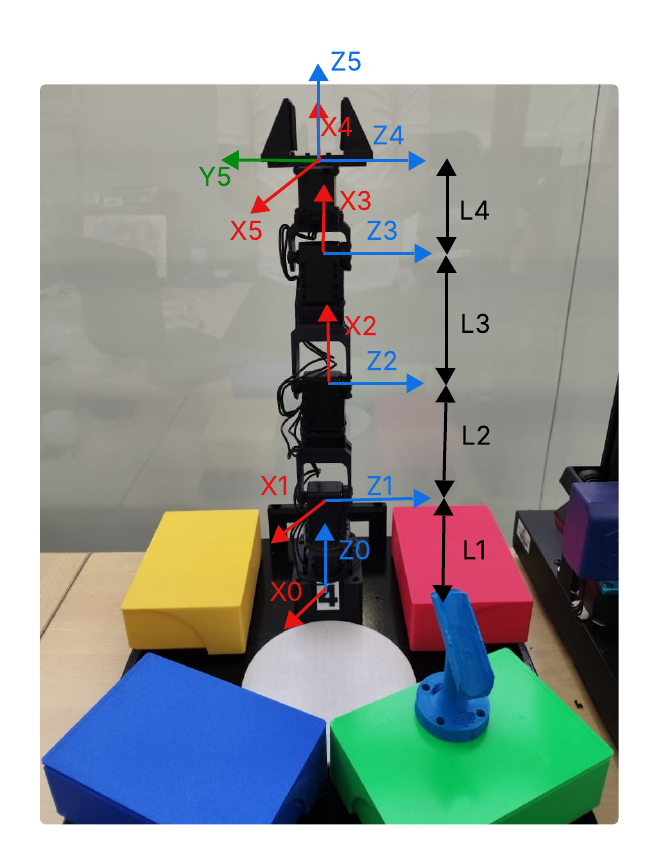
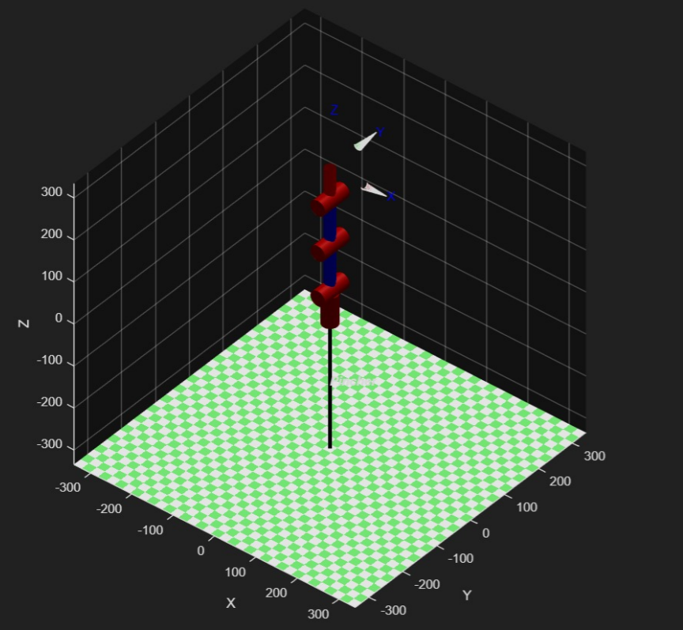
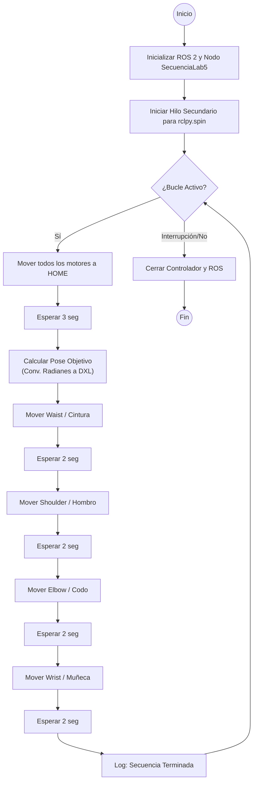
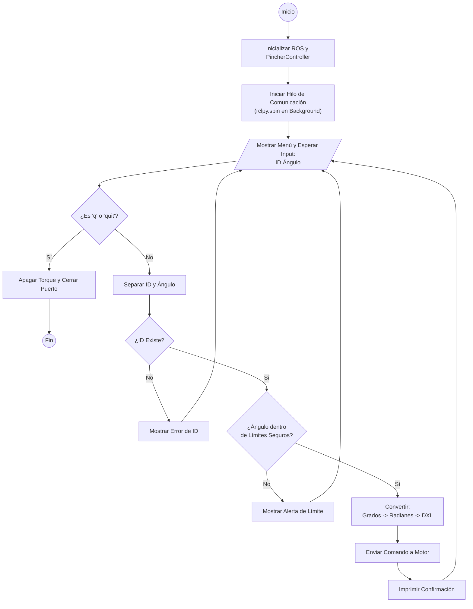
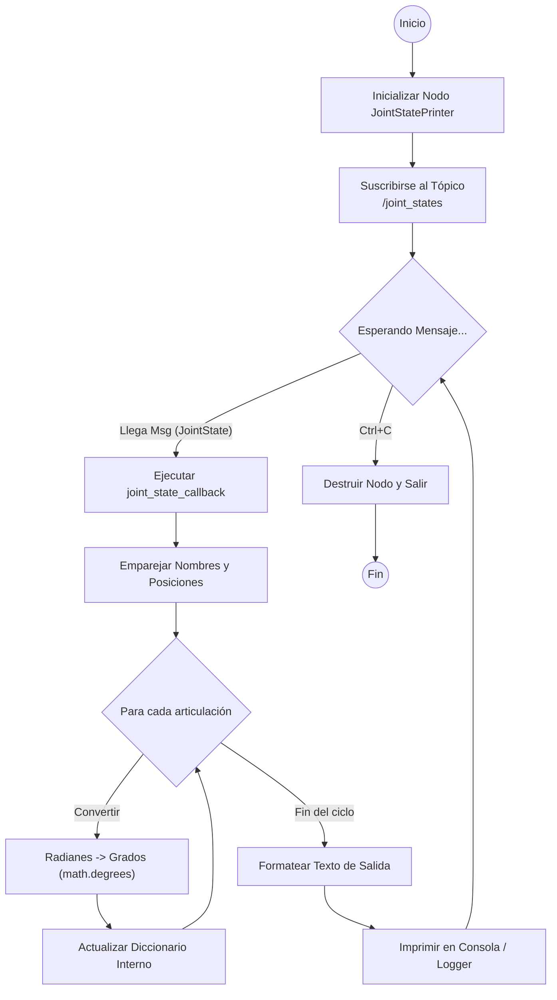
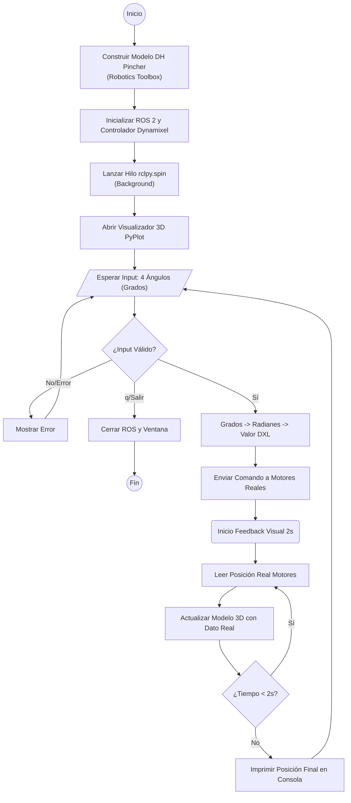

# Laboratorio No. 05 Pincher Phantom X100- ROS Humble- RVIZ

## Integrantes

**Juan Ángel Vargas Rodríguez**
juvargasro@unal.edu.co

**Santiago Mariño Cortés**
smarinoc@unal.edu.co

**Juan José Delgado Estrada**
judelgadoe@unal.edu.co

## Introducción

El presente laboratorio se realiza para aplicar de forma práctica y en un entorno real el aprendizaje de cinemática directa mediante la manipulación de robots Phantom X Pincher, para ello se emplean entornos como python, ROS 2 y el uso de servomotores Dynamixel AX-12.

Adicionalmente con el fin de enviar comandos y poses específicas al robot se implementó una interfaz gráfica, de forma que las configuraciones del robot se puedan observar en tiempo real y validar las posiciones de los resultados de acuerdo a los modelos matemáticos como las matrices de transformación homogénea (MTH) y el modelo de Denavit-Hartenberg.

## Objetivos

- Crear todos los Joint Controllers con ROS para manipular servomotores Dynamixel AX-12 del robot Phantom X Pincher.
- Manipular los tópicos de estado y comando para todos los Joint Controllers del robot Phantom X Pincher.
- Manipular los servicios para todos los Joint Controllers del robot Phantom X Pincher.
- Conectar el robot Phantom X Pincher con Python usando ROS 2.


## Cinemática Directa Robot Pincher Phantom X100
Planteamos los siguientes ejes en el robot para realizar el DH

<p align="center">
  
</p>

Obteniendo el siguiente DH
## Parámetros Denavit-Hartenberg (DH) - PhantomX Pincher

| $i$ | $\theta_i$ (Ángulo) | $d_i$ (Desplazamiento) | $a_i$ (Longitud) | $\alpha_i$ (Torsión) |
| :---: | :---: | :---: | :---: | :---: |
| **1** | $q_1$ | $L_1$ (44 mm) | 0 | $\pi/2$ |
| **2** | $q_2 + \pi/2$ | 0 | $L_2$ (107.5 mm) | 0 |
| **3** | $q_3$ | 0 | $L_3$ (107.5 mm) | 0 |
| **4** | $q_4$ | 0 | $L_4$ (75.3 mm) | 0 |

> **Nota:** $q_i$ representa la variable de articulación. La articulación 2 tiene un offset de $\pi/2$.

Procedemos a poner esto en MATLAB para poder simularlo y usar sus funciones en puntos que veremos más adelante.
```C
L1 = 44
L2 = 107.5
L3 = 107.5
L4 = 75.3


%       theta    d     a     alpha
DH = [    0     L1    0.0    pi/2;  % L1
          0     0.0   L2     0   ;  % L2
          0     0.0   L3     0   ;  % L3
          0     0.0   L4     0   ]; % L4

robot = SerialLink(DH, 'name', 'Pincher')

robot.offset = [0 pi/2 0 0];  % offset para cada articulación

T_tool = trotz(-pi/2) * trotx(-pi/2);  % solo rotación, sin traslación

robot.tool = T_tool;

robot.teach()
```

Gracias a la libreria de Peter Corke obtenemos el siguiente robot en MATLAB:

<p align="center">
  
</p>

Ahora con esta implementación podemos realizar los puntos del taller que requieran una cinemática inversa de forma más fácil.

## Plano de planta del robot
<p align="center">
  
</p>


## Workspace para ROS2

Para el desarrollo del laboratorio se creó el workspace  [phantom_ws](phantom_ws/), donde se encuentran los paquetes y scripts utilizados para la solución de los ejercicios planteados. Este workspaces tiene la siguiente estructura:

```text

phantom_ws/
├── build/
├── install/
├── log/
└── src/
	├── phantomx_pincher_description/
	|    ├── urdf/
	|    |   ├── phantomx_pincher.urdf
	|	 |	├── phantomx_pincher.urdf.xacro
	|	 |	└── kit.xacro
	|	 ├── launch/
	|	 |	├── display.launch.py
	|	 |	└── view.launch.py
	|	 └── meshes/
	├── phantomx_pincher_moveit_config/
	└── pincher_control/
		├── pincher_control/
		|	├── __init__.py
		|	├── control_servo.py
		|	├── HMI_RVIZ.py
		|	├── Lab5_P1.py
		|	├── terminal_control.py
		|	├── terminal_subscriber.py
		|	└── toolbox.py
		└──setup.py

```


## Ciclo Home - Posición objetivo
Este script se encuentra en el workspace [phantom_ws](phantom_ws/) como [Lab5_P1.py](phantom_ws/src/pincher_control/pincher_control/Lab5_P1.py).
El objetivo principal es generar un bucle infinito que alterna entre una posición de reposo (Home) y una pose objetivo definida por cinemática directa (ángulos específicos), moviendo cada articulación de forma secuencial.

A continuación detallo cómo estructuré la lógica:

1. Inicialización y Gestión de Nodos (__init__)

Para empezar, creé la clase SecuenciaLab5 que hereda de Node. Sin embargo, no reinventé la rueda: en lugar de manejar los puertos seriales aquí, instancié un objeto PincherController (importado de pincher_control).

  - Multithreading: Un punto crítico fue el manejo del hilo de ejecución. Como voy a usar comandos bloqueantes (como time.sleep), no podía bloquear el hilo principal de ROS. Por eso, lancé el rclpy.spin del controlador en un threading.Thread en modo daemon. Esto asegura que el robot siga "escuchando" y publicando en los tópicos de ROS en segundo plano mientras mi script ejecuta las pausas de movimiento.

2. La Rutina de Movimiento (ejecutar_secuencia)

Esta es la función "cerebro" del robot. Realiza tres acciones fundamentales en cada ciclo:Retorno a Home: Primero, llamo a home_all_motors_sec(). Esto asegura que el robot siempre tenga un punto de partida conocido y seguro antes de intentar cualquier maniobra compleja.Cálculo de Cinemática (Radianes a DXL): Defino la pose objetivo en radianes (una forma natural de pensar en robótica). Luego, utilizo el método radians_to_dxl para traducir esos ángulos humanos a valores enteros (0-4095) que los servomotores Dynamixel entienden.
  - Movimiento Secuencial: Para evitar colisiones o movimientos bruscos, no muevo todo el robot a la vez. Envío comandos motor por motor (Cintura $\rightarrow$ Hombro $\rightarrow$ Codo $\rightarrow$ Muñeca), introduciendo un time.sleep(2.0) entre cada articulación. Esto permite observar claramente el comportamiento de cada eslabón.
   
3. El Bucle Principal (main)

Finalmente, en la función main, inicializo el entorno de ROS y entro en un bucle while(True). Esto mantiene al robot en una "danza" infinita: va a Home, ejecuta la secuencia, y repite, hasta que el usuario decida terminar el programa (momento en el que se cierran los puertos y se destruyen los nodos limpiamente).

### Diagrama de flujo


## Publisher - Suscriber
Los scripts para este ejercicio se encuentran en el workspace [phantom_ws](phantom_ws/) como [terminal_control.py](phantom_ws/src/pincher_control/pincher_control/terminal_control.py) y [terminal_suscriber.py](phantom_ws/src/pincher_control/pincher_control/terminal_suscriber.py).

Este punto se compone de dos códigos:

### Terminal_control
En este código permitimos que el usuario introduzca comandos específicos ("ID + Ángulo") para probar cada articulación individualmente sin necesidad de una interfaz gráfica compleja.

La lógica interna se estructura así:

1. Inicialización Híbrida

Al igual que en mis otros nodos, inicializo PincherController para gestionar el hardware.

- Concurrencia: Vuelvo a usar un threading.Thread para mantener vivo el ecosistema ROS (rclpy.spin). Esto es fundamental: permite que el robot siga publicando su estado (/joint_states) en segundo plano mientras la terminal se queda "congelada" esperando a que tú escribas un comando (input()).

2. Validación de Seguridad (Safety Checks)

Esta es la parte más robusta del código. Como el control es manual, existe riesgo humano (escribir 500 grados por error). Por eso implementé una serie de filtros antes de mover nada:
- Filtro de ID: Verifico que el ID ingresado (ej: 1, 2, 3...) exista realmente en la lista de motores detectados.
- Límites Articulares: Creé un bloque de condiciones (if/elif) estricto para cada motor. Por ejemplo, el Hombro (ID 2) está restringido a $\pm 100^\circ$, mientras que la Cintura (ID 1) tiene más libertad ($\pm 150^\circ$). Si te pasas, el código bloquea el comando y te avisa.

3. Traducción y Ejecución

Una vez el comando es validado:
- Conversión: Paso los grados a radianes.
- Mapeo: Aplico el signo correcto (joint_sign) según la configuración física del motor.
- Comando DXL: Transformo el valor flotante a un entero (0-4095 o 0-1023) entendible por el protocolo Dynamixel y ejecuto move_motor.

#### Diagrama de flujo



### Terminal_suscriber

Este nodo tiene una función pasiva pero vital: actuar como los "ojos" del operador. Su único trabajo es escuchar lo que el robot dice sobre sí mismo y traducirlo a un formato legible para humanos.

Diseñé la lógica de la siguiente manera:

1. Suscripción al Tópico (__init__)
En lugar de conectar con el hardware directamente (eso ya lo hace el controlador), este nodo se suscribe al tópico estándar /joint_states.

- ¿Por qué? Porque en ROS, la verdad sobre la posición del robot siempre viaja por ese canal. Así, este nodo funciona independientemente de si estás moviendo el robot con tu script de terminal, con una GUI o incluso manualmente con la mano (si los motores tuvieran torque off).

2. El Callback de Procesamiento (joint_state_callback)
Cada vez que el robot publica un mensaje (que suele ser muchas veces por segundo), se activa esta función:

- Mapeo de Datos: El mensaje JointState trae dos listas separadas: nombres (name) y posiciones (position). Utilizo la función zip para emparejarlas correctamente.

- Conversión Matemática: ROS habla nativamente en radianes, pero para depurar errores visualmente preferimos grados. Por eso, convierto cada valor usando math.degrees() antes de guardarlo.

3. Visualización Limpia
En lugar de imprimir líneas infinitas de datos crudos, construyo una cadena de texto formateada (f-string) que muestra las 5 articulaciones en una sola línea horizontal. Esto permite ver los cambios de manera fluida en la consola sin que el texto se desplace tan rápido que sea imposible de leer.

#### Diagrama de flujo



## Robotic Toolbox
Este script se encuentra en el workspace [phantom_ws](phantom_ws/) como [toolbox.py](phantom_ws/src/pincher_control/pincher_control/toolbox.py).

Este script establece un puente entre el hardware real (robot Pincher) y un modelo virtual 3D, permitiendo controlar el robot mediante comandos de teclado y visualizando su movimiento en tiempo real. La arquitectura se basa en tres pilares:

1. Modelado Cinemático (build_pincher_robot)

Lo primero que hago es definir el "esqueleto" matemático del robot utilizando la librería Robotics Toolbox for Python.
- Parámetros DH: Replico la tabla de Denavit-Hartenberg estándar del Pincher (L1=44mm, L2=107.5mm, etc.), convirtiendo todas las medidas a metros.
- Eslabones (Links): Creo una lista de objetos RevoluteDH, configurando distancias ($d, a$) y rotaciones ($\alpha, \text{offset}$) para cada articulación.
- Herramienta: Añado la transformación final (T_tool) para que el sistema de coordenadas de la punta (End Effector) coincida con la orientación real de la pinza.

2. Integración con ROS 2 y Hardware (main - Inicialización)

Al iniciar el programa (main), ocurren dos procesos paralelos cruciales:
- Controlador de Hardware: Instancio PincherController (mi nodo de ROS 2) para manejar la comunicación serial con los motores Dynamixel. Configuro una velocidad segura (50) para evitar movimientos bruscos.
- Hilo de Escucha (Spin Thread): Lanzo un hilo secundario (threading.Thread) que ejecuta rclpy.spin. Esto es vital: permite que el nodo siga recibiendo y publicando datos en /joint_states en segundo plano mientras la terminal espera mis comandos (input del usuario).

3. Bucle de Control Interactivo

El corazón del script es un bucle infinito while True que funciona así:
- Entrada de Usuario: Solicito 4 ángulos en grados (cintura, hombro, codo, muñeca).
- Validación y Seguridad: Verifico que sean números válidos y que estén dentro de un rango seguro ($\pm 150^\circ$) antes de enviarlos.
- Envío al Robot Físico: Convierto los grados a radianes y luego a valores Dynamixel (0-4095), enviando la orden a cada motor.
- Sincronización Visual (Gemelo Digital): Aquí está la magia. En lugar de simplemente mover el modelo 3D al objetivo final, abro una ventana de 2 segundos donde leo continuamente controller.current_joint_positions (los datos reales que vienen de los motores). Actualizo el gráfico pyplot con estos datos reales.
- Resultado: La visualización 3D no muestra "a dónde quiero ir", sino "dónde está el robot realmente" mientras se mueve.

### Diagrama de flujo



## Interfaz gráfica y visualización con RViz
Este script se encuentra en el workspace [phantom_ws](phantom_ws/) como [HMI_RVIZ.py](phantom_ws/src/pincher_control/pincher_control/HMI_RVIZ.py).


## Video de implementación de los scripts

## Conclusiones
