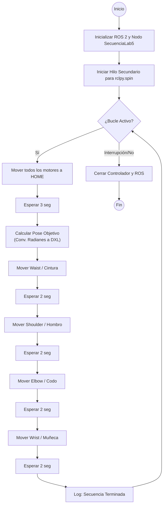

# Laboratorio No. 05 Pincher Phantom X100- ROS Humble- RVIZ

## Integrantes

**Juan Ángel Vargas Rodríguez**
juvargasro@unal.edu.co

**Santiago Mariño Cortés**
smarinoc@unal.edu.co

**Juan José Delgado Estrada**
judelgadoe@unal.edu.co

## Introducción

El presente laboratorio se realiza para aplicar de forma práctica y en un entorno real el aprendizaje de cinemática directa mediante la manipulación de robots Phantom X Pincher, para ello se emplean entornos como python, ROS 2 y el uso de servomotores Dynamixel AX-12.

Adicionalmente con el fin de enviar comandos y poses específicas al robot se implementó una interfaz gráfica, de forma que las configuraciones del robot se puedan observar en tiempo real y validar las posiciones de los resultados de acuerdo a los modelos matemáticos como las matrices de transformación homogénea (MTH) y el modelo de Denavit-Hartenberg.

## Objetivos

- Crear todos los Joint Controllers con ROS para manipular servomotores Dynamixel AX-12 del robot Phantom X Pincher.
- Manipular los tópicos de estado y comando para todos los Joint Controllers del robot Phantom X Pincher.
- Manipular los servicios para todos los Joint Controllers del robot Phantom X Pincher.
- Conectar el robot Phantom X Pincher con Python usando ROS 2.


## Cinemática Directa Robot Pincher Phantom X100
Planteamos los siguientes ejes en el robot para realizar el DH

<p align="center">
  
</p>

Obteniendo el siguiente DH
## Parámetros Denavit-Hartenberg (DH) - PhantomX Pincher

| $i$ | $\theta_i$ (Ángulo) | $d_i$ (Desplazamiento) | $a_i$ (Longitud) | $\alpha_i$ (Torsión) |
| :---: | :---: | :---: | :---: | :---: |
| **1** | $q_1$ | $L_1$ (44 mm) | 0 | $\pi/2$ |
| **2** | $q_2 + \pi/2$ | 0 | $L_2$ (107.5 mm) | 0 |
| **3** | $q_3$ | 0 | $L_3$ (107.5 mm) | 0 |
| **4** | $q_4$ | 0 | $L_4$ (75.3 mm) | 0 |

> **Nota:** $q_i$ representa la variable de articulación. La articulación 2 tiene un offset de $\pi/2$.

Procedemos a poner esto en MATLAB para poder simularlo y usar sus funciones en puntos que veremos más adelante.
```C
L1 = 44
L2 = 107.5
L3 = 107.5
L4 = 75.3


%       theta    d     a     alpha
DH = [    0     L1    0.0    pi/2;  % L1
          0     0.0   L2     0   ;  % L2
          0     0.0   L3     0   ;  % L3
          0     0.0   L4     0   ]; % L4

robot = SerialLink(DH, 'name', 'Pincher')

robot.offset = [0 pi/2 0 0];  % offset para cada articulación

T_tool = trotz(-pi/2) * trotx(-pi/2);  % solo rotación, sin traslación

robot.tool = T_tool;

robot.teach()
```

Gracias a la libreria de Peter Corke obtenemos el siguiente robot en MATLAB:

<p align="center">
  
</p>

Ahora con esta implementación podemos realizar los puntos del taller que requieran una cinemática inversa de forma más fácil.

## Plano de planta del robot
<p align="center">
  
</p>
## Ciclo Home - Posición objetivo

El objetivo principal es generar un bucle infinito que alterna entre una posición de reposo (Home) y una pose objetivo definida por cinemática directa (ángulos específicos), moviendo cada articulación de forma secuencial.

A continuación detallo cómo estructuré la lógica:

1. Inicialización y Gestión de Nodos (__init__)

Para empezar, creé la clase SecuenciaLab5 que hereda de Node. Sin embargo, no reinventé la rueda: en lugar de manejar los puertos seriales aquí, instancié un objeto PincherController (importado de pincher_control).

  - Multithreading: Un punto crítico fue el manejo del hilo de ejecución. Como voy a usar comandos bloqueantes (como time.sleep), no podía bloquear el hilo principal de ROS. Por eso, lancé el rclpy.spin del controlador en un threading.Thread en modo daemon. Esto asegura que el robot siga "escuchando" y publicando en los tópicos de ROS en segundo plano mientras mi script ejecuta las pausas de movimiento.

2. La Rutina de Movimiento (ejecutar_secuencia)

Esta es la función "cerebro" del robot. Realiza tres acciones fundamentales en cada ciclo:Retorno a Home: Primero, llamo a home_all_motors_sec(). Esto asegura que el robot siempre tenga un punto de partida conocido y seguro antes de intentar cualquier maniobra compleja.Cálculo de Cinemática (Radianes a DXL): Defino la pose objetivo en radianes (una forma natural de pensar en robótica). Luego, utilizo el método radians_to_dxl para traducir esos ángulos humanos a valores enteros (0-4095) que los servomotores Dynamixel entienden.
  - Movimiento Secuencial: Para evitar colisiones o movimientos bruscos, no muevo todo el robot a la vez. Envío comandos motor por motor (Cintura $\rightarrow$ Hombro $\rightarrow$ Codo $\rightarrow$ Muñeca), introduciendo un time.sleep(2.0) entre cada articulación. Esto permite observar claramente el comportamiento de cada eslabón.
   
3. El Bucle Principal (main)

Finalmente, en la función main, inicializo el entorno de ROS y entro en un bucle while(True). Esto mantiene al robot en una "danza" infinita: va a Home, ejecuta la secuencia, y repite, hasta que el usuario decida terminar el programa (momento en el que se cierran los puertos y se destruyen los nodos limpiamente).

Para poder entender bien el funcionamiento del código hacemos el siguiente diagrama de flujo:


## Publisher - Suscriber

## Robotic Toolbox

## Interfaz gráfica y visualización con RViz

## Video de implementación de los scripts

## Conclusiones
